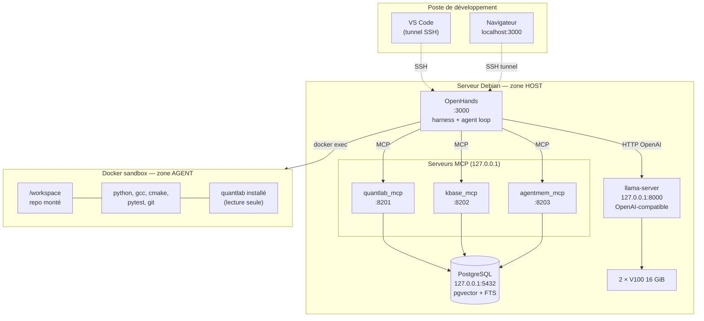
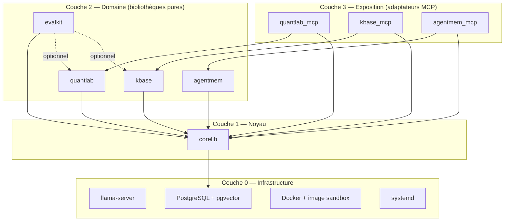
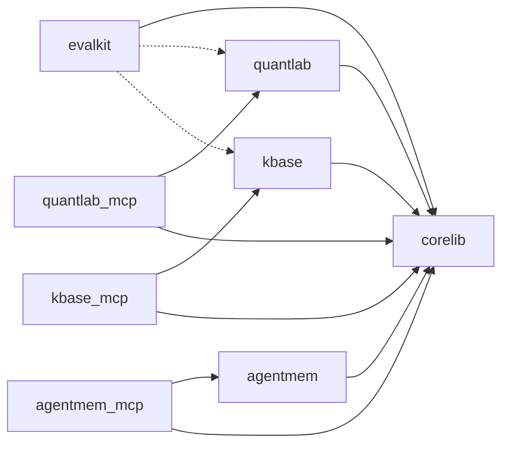
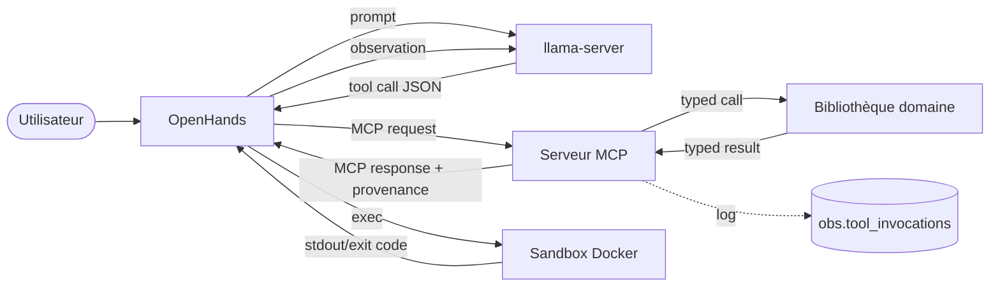
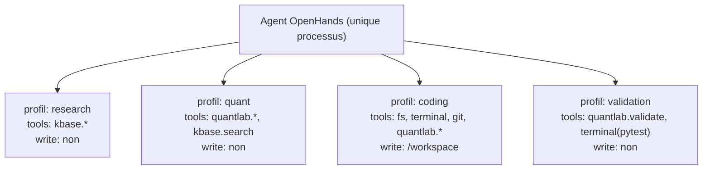

# 01 — Architecture globale

> ⚠ **Références résiduelles** : ce document mentionne encore `quantlab` / `evalkit`,
> abandonnés. Appliquer la table de substitution de [README.md](README.md#correctif-de-périmètre--table-de-substitution).
> Les principes, zones d'exécution et règles de dépendance restent valides.

> Prérequis : [00-PRIMER.md](00-PRIMER.md)

---

## 1. Topologie runtime

Trois zones d'exécution, frontières strictes.



### Règles de zone

| Règle | Détail |
|---|---|
| Le LLM ne voit jamais le host | Il n'émet que des tool calls interprétés par OpenHands. |
| La sandbox n'accède pas à PostgreSQL | Les données passent par les tools MCP, résolus côté host. |
| La sandbox n'accède pas à `llama-server` | Pas de boucle récursive d'inférence. |
| Rien n'écoute sur `0.0.0.0` | Tout est bindé sur `127.0.0.1`. Accès distant = tunnel SSH. |
| La sandbox monte uniquement `/srv/repos/<projet>` → `/workspace` | Aucun autre chemin host. |

---

## 2. Décomposition en composants



### Responsabilité par composant

| Composant | Responsabilité | Ne fait JAMAIS |
|---|---|---|
| `corelib` | config, logging structuré, taxonomie d'erreurs, session DB, helpers d'unités, hashing, IDs, enregistrement des invocations d'outils | métier, I/O réseau applicatif |
| `quantlab` | pricing, calibration, greeks, courbes, méthodes numériques, invariants de validation | accès DB, appel LLM, I/O fichier |
| `kbase` | ingestion documentaire, chunking, embeddings, recherche hybride, reranking, provenance | pricing, appel LLM de génération |
| `agentmem` | mémoire épisodique et procédurale, recherche d'expériences | décider quoi mémoriser (c'est l'agent qui décide) |
| `evalkit` | chargement de suites de test, exécution, scoring, rapports | modifier le système sous test |
| `*_mcp` | validation de schéma, mapping JSON ↔ types du domaine, limites/timeouts, logging | logique métier, calcul, requêtes SQL directes |
| infra | faire tourner le modèle, la base, la sandbox, les services | tout le reste |

---

## 3. Dependency graph — règles de dépendance



**Règles vérifiées automatiquement en CI (`import-linter` ou équivalent) :**

| # | Règle |
|---|---|
| D1 | `corelib` ne dépend d'aucun autre package du repo. |
| D2 | `quantlab`, `kbase`, `agentmem` sont **mutuellement indépendants**. |
| D3 | Aucune bibliothèque de domaine n'importe un package `*_mcp`. |
| D4 | Aucun package n'importe OpenHands. |
| D5 | `quantlab` n'importe ni `sqlalchemy`, ni `psycopg`, ni `httpx`. Il est pur. |
| D6 | Seul `evalkit` a le droit d'importer plusieurs domaines à la fois, et en imports optionnels. |
| D7 | Les modèles de configuration ne sont définis que dans `corelib.config`. |

---

## 4. Frontières et flux de données



**Invariant de frontière** : un serveur MCP ne renvoie jamais un objet du domaine
brut. Il renvoie un **DTO JSON sérialisable** contenant systématiquement :

```
{ "ok": bool, "data": {...} | null, "error": {...} | null, "meta": {...} }
```

où `meta` contient au minimum `duration_ms`, `engine_version`, et pour le RAG la
`provenance`, pour le quant le `run_id` de reproductibilité.

---

## 5. Ports, sockets et services

| Service | Bind | Port | Géré par | Health check |
|---|---|---|---|---|
| `llama-server` | `127.0.0.1` | `8000` | systemd `llama-server.service` | `GET /v1/models` |
| PostgreSQL | `127.0.0.1` | `5432` | Docker Compose ou paquet système | `pg_isready` |
| `quantlab_mcp` | `127.0.0.1` | `8201` | systemd `mcp-quantlab.service` | `GET /health` |
| `kbase_mcp` | `127.0.0.1` | `8202` | systemd `mcp-kbase.service` | `GET /health` |
| `agentmem_mcp` | `127.0.0.1` | `8203` | systemd `mcp-agentmem.service` | `GET /health` |
| OpenHands GUI | `127.0.0.1` | `3000` | lancement manuel puis systemd user unit | `GET /` |

> `[À CONFIRMER]` Le transport MCP retenu (stdio vs SSE/streamable-HTTP) doit être
> vérifié dans la documentation OpenHands. Le blueprint suppose **HTTP/SSE sur le
> host**, car OpenHands tourne partiellement en conteneur ; le pattern est le même
> que pour `llama-server` (`host.docker.internal:host-gateway`). Si seul stdio est
> supporté, seuls les fichiers de lancement changent : les serveurs MCP sont écrits
> pour supporter les deux transports (cf. `03-INTERFACES.md` §6).

---

## 6. Les « agents » dans cette architecture

Les rôles Research / Quant / Coding / Validation **ne sont pas des processus**.
Ce sont des **profils de configuration OpenHands** : un prompt système, une
allowlist d'outils MCP, un jeu de permissions et des limites.



**Phase 1 : un seul profil actif à la fois, un seul agent, une seule sandbox.**
Le multi-agent n'est pas implémenté tant que WP00→WP09 ne sont pas validés.

---

## 7. Points d'extension prévus (ne pas implémenter maintenant, mais ne pas fermer)

| Extension future | Point d'extension prévu dès maintenant |
|---|---|
| Autre modèle LLM | `configs/models.yaml` — registre de profils, aucune modification de code |
| Autre backend vectoriel | `kbase.retrieval.vector.VectorIndex` (Protocol) |
| Autre embedder / reranker | `kbase.embeddings.Embedder`, `kbase.retrieval.rerank.Reranker` (Protocols) |
| Nouveau modèle de pricing | `quantlab.registry` + implémentation du Protocol `PricingModel` |
| Nouvelle méthode numérique | `quantlab.methods` + entrée dans la matrice de capacités |
| Knowledge graph | schéma PostgreSQL `kg` réservé, non créé |
| Multi-agent | profils déjà séparés en fichiers |
| Fine-tuning | `obs.tool_invocations` + `mem.episodes` fournissent les traces |
