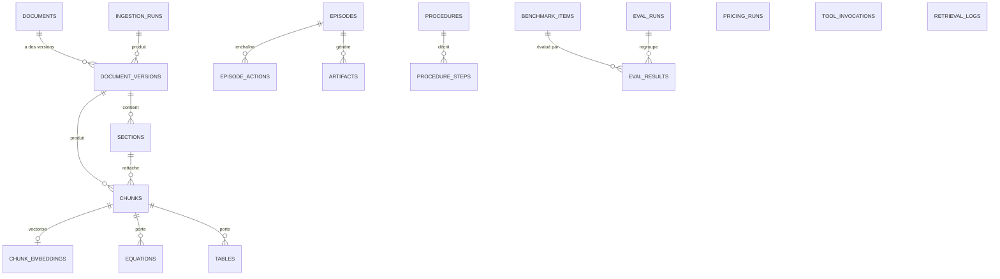

# 04 — Data model (PostgreSQL)

> Prérequis : [00-PRIMER.md](00-PRIMER.md)
>
> Backend unique : **PostgreSQL + pgvector + Full Text Search**. Pas de Qdrant, pas
> d'OpenSearch, pas de Redis en phase 1.
>
> Ce fichier définit **le schéma logique**. Le DDL exact vit dans `migrations/*.sql`.

---

## 1. Extensions et schémas

```sql
CREATE EXTENSION IF NOT EXISTS vector;      -- pgvector
CREATE EXTENSION IF NOT EXISTS pg_trgm;     -- similarité lexicale / fuzzy
CREATE EXTENSION IF NOT EXISTS unaccent;    -- normalisation FTS
```

| Schéma | Contenu | Créé en |
|---|---|---|
| `kb` | corpus documentaire, chunks, embeddings, équations | WP04 |
| `mem` | mémoire épisodique et procédurale | WP07 |
| `eval` | benchmarks, exécutions, résultats | WP09 |
| `obs` | invocations d'outils, logs de retrieval | WP01 |
| `quant` | enregistrements de reproductibilité de pricing | WP02 |
| `kg` | **réservé**, non créé en phase 1 (knowledge graph futur) | — |

---

## 2. Diagramme entité-relation



---

## 3. Schéma `kb`

### `kb.documents`
Identité logique d'un document, indépendante de ses versions.

| Colonne | Type | Contrainte |
|---|---|---|
| `id` | `uuid` | PK |
| `doc_key` | `text` | **UNIQUE**, slug stable (`heston_1993`) |
| `title` | `text` | NOT NULL |
| `authors` | `text[]` | NOT NULL DEFAULT `{}` |
| `year` | `int` | NULL |
| `doc_type` | `text` | NOT NULL, CHECK dans l'énum |
| `topic` | `text` | NULL |
| `asset_class` | `text` | NULL |
| `source_url` | `text` | NULL |
| `license` | `text` | NULL |
| `created_at` | `timestamptz` | NOT NULL DEFAULT now() |

### `kb.document_versions`
Une version = un fichier physique parsé par un parser donné.

| Colonne | Type | Contrainte |
|---|---|---|
| `id` | `uuid` | PK |
| `document_id` | `uuid` | FK → `kb.documents` ON DELETE CASCADE |
| `version` | `text` | NOT NULL |
| `file_path` | `text` | NOT NULL |
| `sha256` | `text` | **UNIQUE**, NOT NULL |
| `page_count` | `int` | NULL |
| `publication_date` | `date` | NULL |
| `ingestion_date` | `timestamptz` | NOT NULL |
| `parser_name` / `parser_version` | `text` | NOT NULL |
| `ingestion_run_id` | `uuid` | FK → `kb.ingestion_runs` |
| `status` | `text` | `pending` \| `parsed` \| `indexed` \| `failed` |

> **Idempotence** : `sha256` UNIQUE. Réingérer un fichier identique est un no-op.

### `kb.sections`
Arbre de sections reconstruit.

`id` (PK) · `document_version_id` (FK) · `parent_id` (FK self, NULL) · `level` int ·
`ordinal` int · `title` text · `page_start` int · `page_end` int · `path` text (`3.2.1`)

UNIQUE `(document_version_id, path)`.

### `kb.chunks`
Unité indexée. **Table centrale du RAG.**

| Colonne | Type | Note |
|---|---|---|
| `id` | `uuid` | PK |
| `document_version_id` | `uuid` | FK, ON DELETE CASCADE |
| `section_id` | `uuid` | FK, NULL |
| `ordinal` | `int` | ordre dans le document |
| `kind` | `text` | `text` \| `equation` \| `table` \| `caption` |
| `content` | `text` | NOT NULL |
| `n_tokens` | `int` | NOT NULL |
| `page_start` / `page_end` | `int` | NULL |
| `has_equations` | `bool` | NOT NULL DEFAULT false |
| `valid_from` | `date` | NULL |
| `valid_until` | `date` | NULL — NULL = toujours valide |
| `source_date` | `date` | NULL |
| `sha256` | `text` | NOT NULL |
| `search_tsv` | `tsvector` | maintenu par trigger, cf. §6 |
| `created_at` | `timestamptz` | NOT NULL |

UNIQUE `(document_version_id, ordinal)`.

### `kb.chunk_embeddings`
Séparée de `chunks` pour permettre plusieurs modèles d'embedding en parallèle.

| Colonne | Type | Note |
|---|---|---|
| `chunk_id` | `uuid` | FK, ON DELETE CASCADE |
| `model_name` | `text` | |
| `model_version` | `text` | |
| `dim` | `int` | |
| `embedding` | `vector(D)` | D fixé par migration, cf. §5 |
| `created_at` | `timestamptz` | |

PK composite `(chunk_id, model_name, model_version)`.

### `kb.equations`
`id` · `chunk_id` FK · `document_version_id` FK · `latex` text NOT NULL ·
`equation_number` text · `page` int · `symbols` text[] · `context_before` text ·
`context_after` text

Index GIN sur `symbols`, index trigram sur `latex`.

### `kb.tables`
`id` · `chunk_id` FK · `caption` text · `content_md` text · `page` int

### `kb.ingestion_runs`
`id` · `started_at` · `finished_at` · `status` · `config_sha` ·
`documents_seen` · `documents_ingested` · `chunks_written` · `errors jsonb`

### `kb.retrieval_logs`
`id` · `ts` · `query_text` · `filters jsonb` · `strategy` · `k` · `latency_ms` ·
`result_chunk_ids uuid[]` · `scores jsonb` · `correlation_id`

> Sert directement à l'évaluation du RAG (WP09) et à la collecte de traces pour un
> éventuel fine-tuning ultérieur.

---

## 4. Schémas `mem`, `eval`, `obs`, `quant`

### `mem.episodes`
`episode_id` PK · `task_id` · `agent_profile` · `goal` text · `started_at` ·
`ended_at` · `status` · `summary` text · `outcome jsonb` · `lessons text[]` ·
`tags text[]` · `branch` text · `last_commit` text · `embedding vector(D)`

### `mem.episode_actions`
`id` PK · `episode_id` FK · `ordinal` · `kind` (`tool` \| `llm` \| `human`) ·
`name` · `args jsonb` · `result_summary` text · `status` · `duration_ms`

### `mem.artifacts`
`id` PK · `episode_id` FK · `kind` · `path` · `sha256`

### `mem.procedures`
`name` + `version` PK composite · `description` · `preconditions text[]` ·
`postconditions text[]` · `steps jsonb` · `tags text[]` · `source_path` ·
`updated_at`

> **Source de vérité = Git** (`agents/procedures/*.md|yaml`). La table est un cache
> interrogeable, reconstruit par `agentmem.procedural.sync_from_git()`.

### `eval.benchmark_items`
`item_id` PK · `suite` · `category` · `question` · `reference_answer` ·
`reference_value numeric` · `tolerance_abs` · `tolerance_rel` ·
`expected_sources text[]` · `difficulty` · `source` · `held_out bool`

### `eval.runs`
`run_id` PK · `ts` · `suite` · `git_commit` · `model` · `retrieval_enabled bool` ·
`system_config jsonb`

### `eval.results`
`id` PK · `run_id` FK · `item_id` FK · `answer` · `value numeric` · `passed bool` ·
`score` · `metrics jsonb` · `retrieved_doc_keys text[]` · `latency_ms` · `tokens` ·
`judge`

UNIQUE `(run_id, item_id)`.

### `obs.tool_invocations`
`id` PK · `ts` · `server` · `tool` · `args jsonb` · `args_sha` · `status` ·
`duration_ms` · `error_code` · `error_message` · `caller` · `correlation_id`

### `quant.pricing_runs`
`run_id` PK · `ts` · `model` · `model_version` · `method` · `engine_version` ·
`code_commit` · `seed` · `tolerance` · `inputs jsonb` · `inputs_sha` ·
`outputs jsonb` · `hardware`

> Permet de rejouer à l'identique un prix produit il y a six mois.

---

## 5. Dimension des embeddings

`vector(D)` exige un `D` **fixe** à la création de la table.

| Décision | Règle |
|---|---|
| `D` est défini dans `configs/kbase.yaml` (`embeddings.dim`) et **répliqué** dans la migration. |
| Changer de modèle d'embedding avec une autre dimension ⇒ **nouvelle migration** créant `kb.chunk_embeddings_<dim>` ou altérant le type, puis réindexation complète. |
| `kbase` refuse de démarrer si `embeddings.dim` ≠ dimension effective en base (check au boot). |

---

## 6. Index

| Table | Index | Type | Raison |
|---|---|---|---|
| `kb.chunks` | `search_tsv` | **GIN** | Full Text Search |
| `kb.chunks` | `(document_version_id, ordinal)` | B-tree UNIQUE | ordre & idempotence |
| `kb.chunks` | `(has_equations)`, `(valid_from, valid_until)` | B-tree partiel | filtres |
| `kb.chunk_embeddings` | `embedding` | **HNSW** (`vector_cosine_ops`) | ANN |
| `kb.documents` | `doc_key` | UNIQUE | résolution |
| `kb.documents` | `(doc_type, topic, asset_class, year)` | B-tree composite | filtres metadata |
| `kb.equations` | `symbols` | GIN | recherche par symbole (κ, θ, ρ) |
| `kb.equations` | `latex` | GIN trigram | recherche lexicale de formule |
| `mem.episodes` | `embedding` | HNSW | rappel sémantique |
| `mem.episodes` | `tags` | GIN | filtres |
| `obs.tool_invocations` | `(ts)`, `(server, tool)` | B-tree | analyse |

### `search_tsv` — construction

Maintenu par trigger `BEFORE INSERT OR UPDATE` sur `kb.chunks` :

```text
search_tsv =
    setweight(to_tsvector('simple', unaccent(coalesce(section_title,''))), 'A')
 || setweight(to_tsvector('simple', unaccent(content)), 'B')
```

> Configuration `'simple'` volontaire : le stemming anglais casse les termes
> techniques (`SABR`, `SOFR`, `CVA`). Les symboles grecs et sigles doivent survivre
> intacts. À valider par les tests de retrieval du WP05.

---

## 7. Politique de migration

| Règle | Détail |
|---|---|
| Fichiers numérotés, immuables après merge | `migrations/NNNN_description.sql` |
| Toute migration est **forward-only** | pas de `down`. Corriger = ajouter une migration. |
| Aucune donnée applicative dans une migration | sauf données de référence énumérées |
| `apply_migrations()` est idempotent | table `public.schema_migrations` |
| Suppression de colonne | en 2 temps : arrêt d'usage → migration suivante |

---

## 8. Rétention & volumétrie

| Table | Rétention | Action |
|---|---|---|
| `obs.tool_invocations` | 90 jours | purge planifiée |
| `kb.retrieval_logs` | 180 jours | purge planifiée, agrégats conservés |
| `kb.chunks` / embeddings | illimitée | réindexation sur changement de modèle |
| `mem.episodes` | illimitée | c'est le capital du système |
| `eval.results` | illimitée | comparabilité historique |

---

## 9. Sécurité base de données

| Règle |
|---|
| PostgreSQL écoute sur `127.0.0.1` uniquement. |
| Trois rôles : `app_rw` (services), `app_ro` (evalkit, lecture), `migrator` (DDL). |
| Les services applicatifs n'ont **pas** le droit DDL. |
| Le mot de passe vient de l'environnement, jamais du code ni des logs. |
| La sandbox Docker **n'a aucun accès réseau** à PostgreSQL. |
| Toutes les requêtes sont paramétrées. Aucune concaténation SQL — y compris pour les filtres metadata, qui sont construits par une allowlist de colonnes. |
