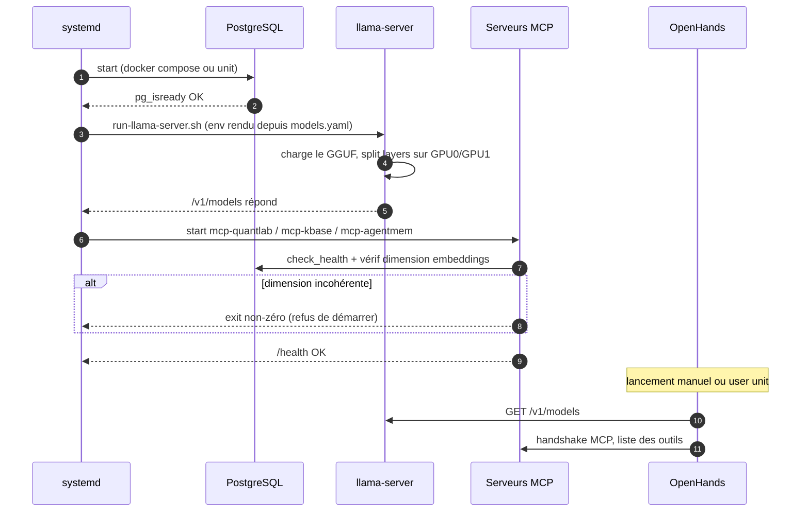
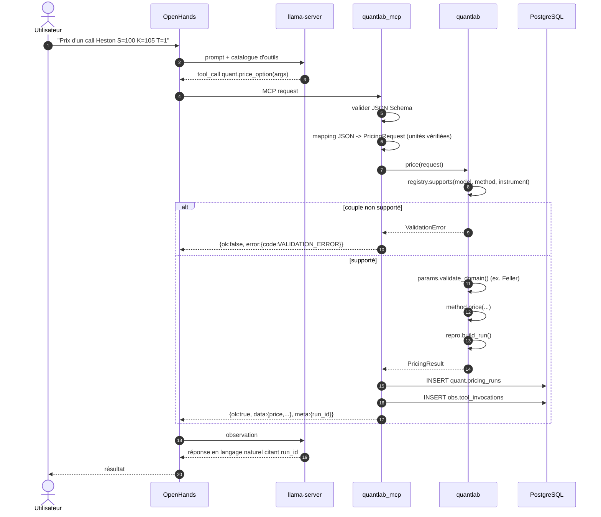
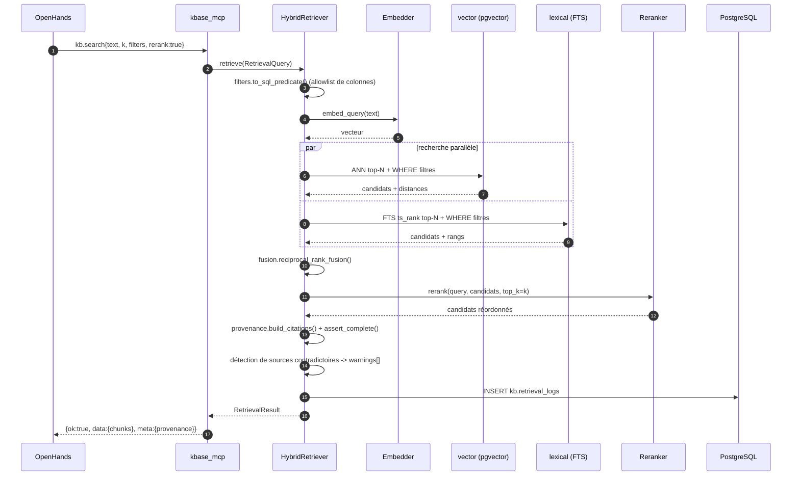
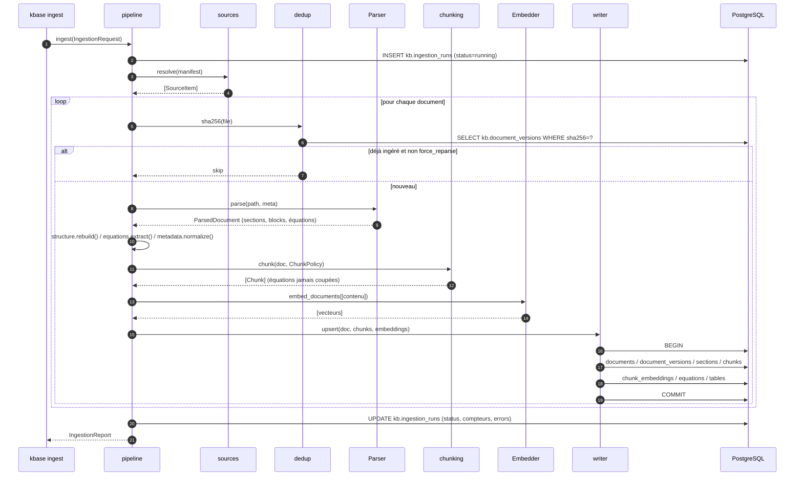
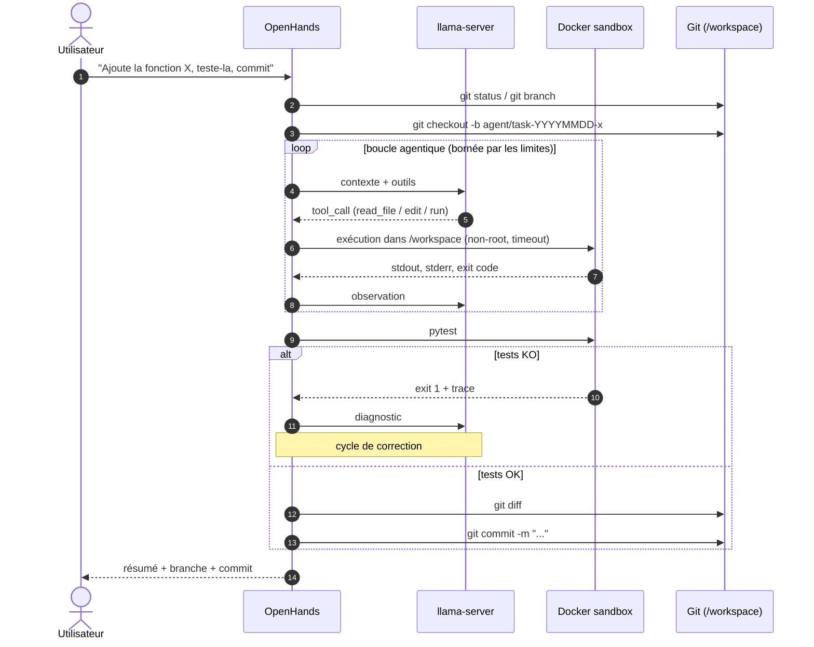
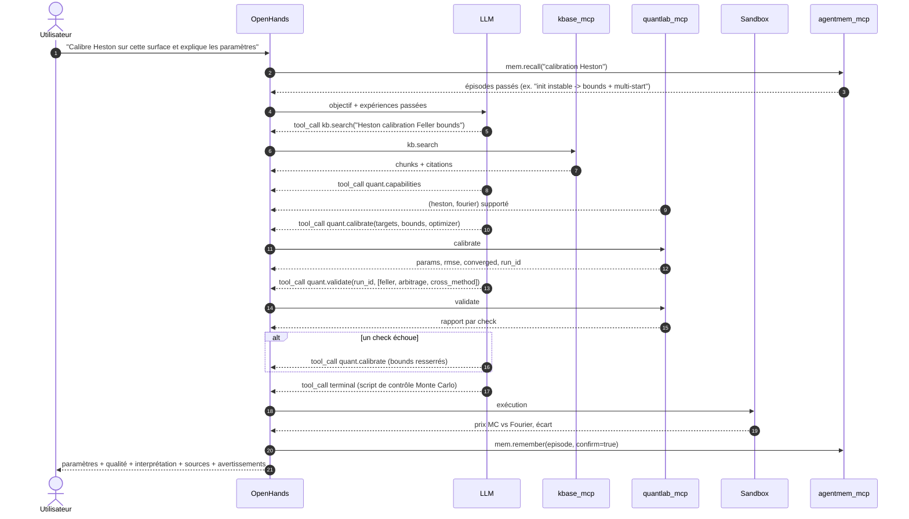
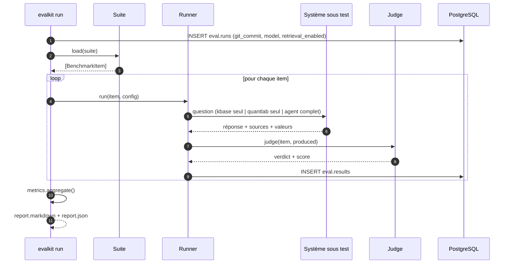
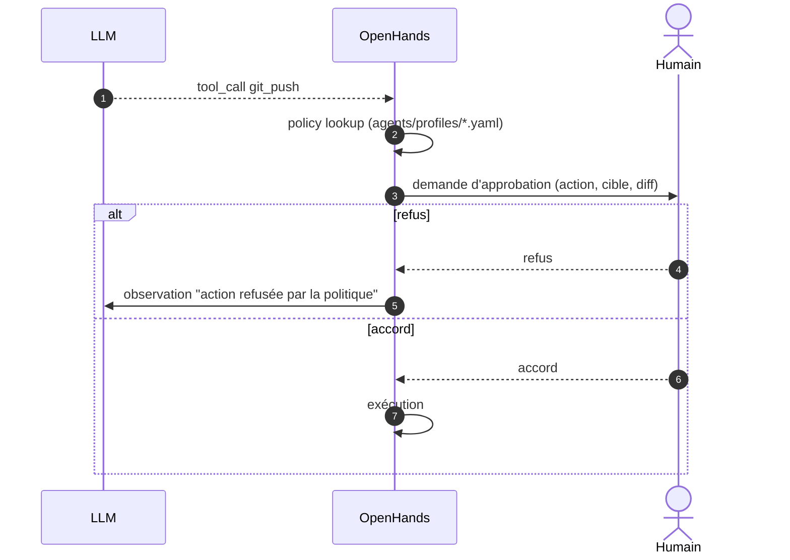

# 05 — Diagrammes de séquence

> ⚠ **§2 (appel quant) et §6 (calibration Heston) sont obsolètes** : ils supposaient
> un moteur Python. Le schéma d'appel d'outil MCP qu'ils décrivent reste néanmoins
> le modèle à suivre, en remplaçant `quantlab_mcp` par `cppdev`/`codeintel`/`qmharness`.
> **§1, §3, §4, §5, §7, §8 et §9 restent valides.**

> Prérequis : [00-PRIMER.md](00-PRIMER.md), [01-ARCHITECTURE.md](01-ARCHITECTURE.md)
>
> Ces diagrammes définissent **l'ordre des appels et les responsabilités**. Ils font
> foi en cas d'ambiguïté d'implémentation.

---

## 1. Démarrage du système

**Ordre imposé** : PostgreSQL → llama-server → MCP → OpenHands. Chaque étape est
bloquante ; aucun démarrage dégradé.

---

## 2. Appel d'outil quantitatif (chemin nominal)

**Invariants** :
- Le LLM ne voit jamais une exception Python brute.
- `run_id` est toujours propagé jusqu'à la réponse finale.
- L'échec de l'écriture `obs` ne fait pas échouer l'outil (log WARNING).

---

## 3. Recherche RAG hybride

**Invariants** :
- Aucun chunk ne sort sans citation complète (`assert_complete` lève sinon).
- Les filtres ne sont jamais concaténés en SQL brut.
- Si le reranker est indisponible : `warnings` + résultat fusionné, jamais d'échec silencieux masqué.

---

## 4. Ingestion documentaire

**Invariants** :
- **Une transaction par document.** Un document échoué n'empêche pas les suivants ;
  il est consigné dans `errors[]` et le run finit en `partial`.
- L'ingestion est **idempotente** : même fichier ⇒ aucun effet.
- `dry_run` exécute tout sauf l'écriture.

---

## 5. Tâche de code avec sandbox, tests et checkpoint Git

**Invariants** :
- Jamais de commit sur `main`.
- `git push`, `merge`, suppression massive ⇒ **approbation humaine** (cf. §8).
- La sandbox n'a ni accès à PostgreSQL, ni à `llama-server`, ni aux secrets du host.

---

## 6. Scénario composite — calibration Heston de bout en bout

**Séparation obligatoire dans la réponse finale** :
`Source` (issue de kb.search, citée) / `Raisonnement` (produit par le LLM) /
`Résultat calculé` (issu de quantlab, avec `run_id`).

---

## 7. Exécution d'une évaluation

**Règle** : la même suite est exécutée avec `retrieval_enabled=false` puis `true`.
Le gain du RAG est la différence, jamais une valeur absolue isolée.

---

## 8. Approbation humaine

**Actions exigeant une approbation** : `git push`, merge, suppression massive,
modification de secrets, accès production, base non sandboxée, installation sur le
host, commande système destructive, changement firewall/driver/CUDA.

**Le modèle ne peut pas modifier cette politique** : elle vit dans des fichiers du
host hors `/workspace`.

---

## 9. Chemins d'erreur — comportement attendu

| Situation | Comportement |
|---|---|
| `llama-server` indisponible | OpenHands échoue explicitement. Aucun fallback vers une API distante. |
| PostgreSQL indisponible | Les serveurs MCP renvoient `DEPENDENCY_ERROR` `retryable=true`. `quantlab` continue de fonctionner (il ne dépend pas de la base pour calculer ; seule la persistance du `run` échoue → WARNING). |
| Reranker indisponible | Retrieval dégradé documenté : résultat fusionné + `warnings`. |
| Embedder indisponible | `kb.search` échoue en `DEPENDENCY_ERROR`. Pas de recherche lexicale seule en remplacement silencieux. |
| Timeout d'outil | `TIMEOUT` `retryable=true`, l'exécution sous-jacente est annulée. |
| Non-convergence numérique | `NUMERICAL_ERROR` `retryable=false`, avec diagnostics. **Jamais** un prix renvoyé sans convergence. |
| Dépassement de limite d'itérations | OpenHands arrête la tâche en `FAILED`, l'état est persisté. |
