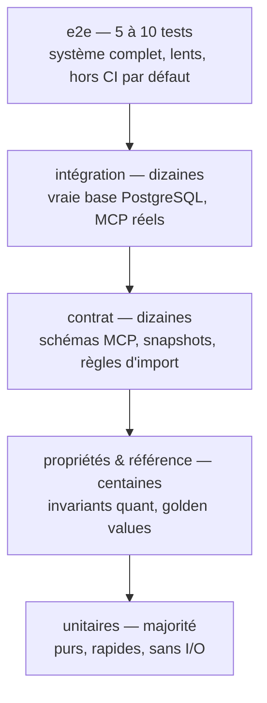

# 08 — Stratégie de test

> ⚠ **§3 (invariants numériques) déménage** : ces tests appartiennent désormais au
> repo C++ `quant-modeling` et au harnais [WP09](wp/WP09-numerical-harness.md).
> Le contenu reste juste, seul son lieu d'exécution change.
> **Tout le reste (§1, §2, §4 à §10) reste valide pour les packages Python de l'atelier.**

> Prérequis : [00-PRIMER.md](00-PRIMER.md)
>
> À lire **avant** d'écrire du code. Les tests ne sont pas une étape finale : les
> invariants ci-dessous définissent la correction du système.

---

## 1. Pyramide



| Niveau | Marqueur pytest | Dépendances | Dans la CI |
|---|---|---|---|
| unitaire | (aucun) | aucune | oui |
| propriétés / référence | `@pytest.mark.numeric` | aucune | oui |
| contrat | `@pytest.mark.contract` | aucune | oui |
| intégration | `@pytest.mark.integration` | PostgreSQL | oui |
| e2e | `@pytest.mark.e2e` | GPU, llama-server, OpenHands, Docker | **non** — manuel |

---

## 2. Tests unitaires — règles

| # | Règle |
|---|---|
| U1 | Aucun I/O : ni réseau, ni disque, ni base. Les dépendances passent par les `Protocol` de [03-INTERFACES.md](03-INTERFACES.md). |
| U2 | Aucun `sleep`. L'horloge vient de `corelib.time`, injectable. |
| U3 | Un test = une assertion de comportement. Le nom décrit le comportement, pas la fonction. |
| U4 | Les cas d'erreur sont testés autant que les cas nominaux : chaque `AppError` levée par un module public a un test. |
| U5 | Pas de mock de ce qu'on ne possède pas. On mocke nos `Protocol`, pas `psycopg`. |

---

## 3. `quantlab` — invariants numériques obligatoires

Ce sont les tests les plus importants du projet. Ils remplacent la confiance dans le LLM.

### 3.1 Invariants analytiques (tests de propriétés)

| Invariant | Formulation |
|---|---|
| Parité call/put | $C - P = S e^{-qT} - K e^{-rT}$ |
| Bornes de non-arbitrage | $\max(Se^{-qT} - Ke^{-rT}, 0) \le C \le Se^{-qT}$ |
| Monotonie en strike | $\partial C/\partial K \le 0$, $\partial P/\partial K \ge 0$ |
| Monotonie en volatilité | $\partial C/\partial \sigma \ge 0$ (vega positif) |
| Convexité en strike | $\partial^2 C/\partial K^2 \ge 0$ |
| Limite $\sigma \to 0$ | prix → valeur intrinsèque actualisée |
| Limite $T \to 0$ | prix → payoff immédiat |
| Aller-retour vol implicite | `implied_vol(price(σ)) ≈ σ` à `1e-8` |
| Condition de Feller (Heston) | $2\kappa\theta \ge \sigma^2$ — violation ⇒ avertissement explicite, pas un échec silencieux |

Générateurs de paramètres via `hypothesis`, bornés par `configs/quantlab.yaml → sanity`.

### 3.2 Cohérence inter-méthodes

Pour chaque couple supporté par `capability_matrix()` :

| Test | Tolérance |
|---|---|
| Black-Scholes : `analytic` vs `monte_carlo` | dans 3 erreurs-types MC |
| Black-Scholes : `analytic` vs `pde` vs `binomial` | tolérance relative configurée |
| Heston : `fourier` vs `monte_carlo` | dans 3 erreurs-types MC |
| Greeks `analytic` vs `bump` | tolérance relative configurée |

### 3.3 Convergence

| Test | Attendu |
|---|---|
| Monte Carlo | erreur ∝ $1/\sqrt{N}$ — pente vérifiée sur une échelle log-log |
| PDE | erreur décroît lors du raffinement de grille |
| Fourier | stabilité au-delà d'un nombre de termes |

### 3.4 Valeurs de référence (golden values)

`benchmarks/golden/reference_prices.yaml` : cas de test avec valeurs de référence
et source documentée. Test de non-régression stricte.

```yaml
- id: bs_call_atm_1y
  model: black_scholes
  method: analytic
  inputs: {spot: 100, strike: 100, maturity_years: 1.0, rate: 0.03, vol: 0.20, dividend: 0.0}
  expected: {price: <valeur>, tolerance_abs: 1.0e-10}
  source: "<référence explicite>"
```

> Les valeurs sont produites lors de l'implémentation puis **vérifiées** contre une
> source externe indépendante. Ne jamais figer une valeur produite par le code
> lui-même sans vérification croisée.

### 3.5 Déterminisme

Même `PricingRequest` + même `seed` ⇒ résultat **bit-identique**. Test explicite.

---

## 4. `kbase` — tests

### 4.1 Ingestion

| Test | Attendu |
|---|---|
| Idempotence | ingérer 2× le même fichier ⇒ compteurs inchangés au 2ᵉ passage |
| Transactionnalité | échec au milieu de l'écriture ⇒ aucun chunk partiel en base |
| Isolation d'échec | 1 document sur 5 échoue ⇒ 4 ingérés, run `partial`, erreur consignée |
| Équations préservées | équation jamais coupée par le chunking ; LaTeX identique à la source |
| Overlap | recouvrement conforme à la policy, pas de duplication de chunk complet |
| Provenance | chaque chunk permet de construire une `Citation` complète |
| Temporalité | `valid_from`/`valid_until` correctement propagés |

### 4.2 Retrieval — jeu de test doré

Un mini-corpus de test versionné (`tests/fixtures/corpus/`) + un jeu de requêtes
avec les chunks attendus.

| Test | Seuil |
|---|---|
| Requête lexicale pure (`SABR`, `SOFR`, `CVA`, `κ`) | le chunk attendu est dans le top-k — **c'est le test qui justifie la présence du FTS** |
| Requête sémantique paraphrasée | le chunk attendu est dans le top-k |
| Requête hybride | ≥ performance de chaque branche isolée |
| Filtres metadata | aucun résultat hors filtre |
| Filtre temporel | un chunk `valid_until` dépassé n'est pas retourné si `valid_at` est fourni |
| Reranking | améliore le MRR sur le jeu doré |
| Injection SQL dans les filtres | rejeté par l'allowlist, aucune requête exécutée |

### 4.3 Contradictions

Deux chunks contradictoires en base ⇒ `RetrievalResult.warnings` non vide.

---

## 5. Tests de contrat

| Cible | Test |
|---|---|
| Schémas MCP | **snapshot** des JSON Schemas d'entrée/sortie de chaque outil. Toute dérive = échec de CI, à valider explicitement. |
| `capability_matrix()` | snapshot. Ajouter un couple est un acte délibéré. |
| Enveloppe de réponse MCP | tout outil renvoie la forme `{ok, data, error, meta}` |
| Erreurs MCP | une exception non-`AppError` produit `INTERNAL_ERROR` sans fuite de trace |
| Règles de dépendance | `import-linter` vérifie D1→D7 de [01-ARCHITECTURE.md](01-ARCHITECTURE.md) §3 |
| Migrations | migrations appliquées sur base vide ⇒ schéma attendu ; aucune migration modifiée après merge (hash) |

---

## 6. Tests d'intégration

Base PostgreSQL réelle, schéma dédié par session de test, détruit en fin.

| Test | Contenu |
|---|---|
| `test_db_schema` | migrations appliquées, extensions présentes, index créés |
| `test_ingestion_roundtrip` | fixture PDF → ingestion → recherche → citation complète |
| `test_retrieval_quality` | jeu doré, seuils de `configs/evalkit.yaml` |
| `test_mcp_contracts` | serveurs MCP démarrés en process, appel réel de chaque outil |
| `test_dimension_guard` | `dim` incohérent ⇒ refus de démarrage |

Fixtures : `conftest.py` racine fournit `db_session`, `settings_override`,
`tmp_corpus`, `fake_embedder` (déterministe), `fake_reranker`.

---

## 7. Tests de discipline (CI)

| Test | Vérifie |
|---|---|
| `test_no_hardcoded_paths` | aucun chemin absolu littéral dans `packages/**/src/**` |
| `test_no_hardcoded_ports` | aucun port littéral hors `corelib.config` et `configs/` |
| `test_no_bare_except` | aucun `except:` ni `except Exception: pass` |
| `test_no_print` | aucun `print(` hors `cli.py` |
| `test_quantlab_purity` | `quantlab` n'importe ni DB, ni HTTP, ni client LLM |
| `test_no_agent_framework` | aucun import de LangChain/LlamaIndex/CrewAI |
| `test_secrets_not_logged` | les champs `SecretStr` ne sont pas sérialisables en clair |

---

## 8. Tests e2e (manuels, hors CI)

Ordre d'exécution. Chacun est **bloquant** pour le suivant.

| # | Test | Critère |
|---|---|---|
| E1 | `healthcheck.sh` | code retour 0 |
| E2 | `test_llama_server` | `/v1/models` + génération courte |
| E3 | VRAM | poids 100 % en VRAM, réparties sur les 2 GPU, aucun offload |
| E4 | `test_openhands_reaches_llm` | depuis le conteneur, `host.docker.internal:8000/v1/models` |
| E5 | MCP handshake | OpenHands liste les outils des 3 serveurs |
| E6 | Sandbox | démarre, `/workspace` monté, utilisateur non-root |
| E7 | Isolation | depuis la sandbox : pas d'accès à PostgreSQL, `llama-server`, `~/.ssh`, `/etc` |
| E8 | `test_agent_smoke` | read → edit → pytest → échec → correction → pytest → `git diff` → commit |
| E9 | Redémarrage | après reboot, tous les services remontent |
| E10 | Approbation | une action `git push` déclenche une demande d'approbation |

---

## 9. Definition of Done par work package

- [ ] Tous les tests unitaires du package passent.
- [ ] Les invariants applicables (§3, §4) sont couverts.
- [ ] Les snapshots de contrat sont générés et commités.
- [ ] `mypy --strict` passe sur le package.
- [ ] Les règles de discipline (§7) passent.
- [ ] Les tests d'intégration touchant le package passent.
- [ ] Le health check du package retourne OK.
- [ ] `docs/limitations.md` est mis à jour avec ce qui **n'est pas** couvert.

---

## 10. Ce qu'on ne teste pas (assumé)

| Non testé | Raison |
|---|---|
| Performance du LLM (tokens/s) | mesuré par benchmark, pas par test |
| Qualité des réponses en langage naturel | relève de `evalkit`, pas de la CI |
| Comportement du driver NVIDIA | hors périmètre applicatif |
| API internes d'OpenHands | dépendance externe, testée par E4/E5/E8 uniquement |
