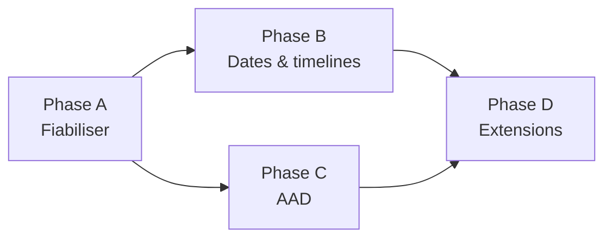

# 10 — Repo cible : `quant-modeling` (C++)

> **Le repo `quant-modeling` est le produit. `AgenticEnv` est l'atelier.**
>
> Ce document décrit l'état des lieux du repo cible, ses écarts, et la feuille de
> route d'ingénierie. C'est **ce que l'agent doit construire**, par opposition aux
> WP00–WP09 qui décrivent **l'outillage pour le construire**.

Source : https://github.com/HadrienT/quant-modeling — MIT, C++ 54.6 %, Jupyter 17 %,
TypeScript 15 %, Python 11.2 %.

---

## 1. État des lieux

### Architecture existante

```text
include/quantModeling/          src/                    autres
├── core/       types, results  ├── engines/{mc,analytic,pde,tree}
├── market/     discount_curve  ├── instruments/        api/        FastAPI
├── instruments/{equity,rates,  ├── models/             web/        TypeScript
│               commodity,fx}   ├── pricers/adapters/   bindings/python
├── models/{equity,rates,       ├── module.cpp  pybind11 benchmarks/
│          commodity}           └── ...                 notebooks/
├── engines/{mc,analytic,...}                           tests/      GoogleTest
├── pricers/    registry, ctx                           .github/workflows
└── utils/      rng, sobol, greeks, stats
CMake + CMakePresets + vcpkg + Eigen3 + pre-commit
```

**Patron** : visiteur. `Instrument::accept(IInstrumentVisitor&)` → `EngineBase` →
`PricingResult`. Dispatch par `PricingRegistry` sur
`(InstrumentKind, ModelKind, EngineKind)`.

### Couverture actuelle

| Axe | Contenu |
|---|---|
| **Instruments** (26) | vanilla, américaine, asiatique, barrière, digitale, lookback, panier, future, ZCB, obligation à taux fixe, option sur obligation, cap/floor, caplet, autocall, mountain, variance swap, volatility swap, dispersion, FX forward/option, commodity forward/option, worst-of, best-of, rainbow |
| **Modèles** (8) | Black-Scholes, FlatRate, Dupire local vol, Vasicek, CIR, Hull-White, Garman-Kohlhagen, Commodity Black |
| **Moteurs** | Analytic, Monte Carlo, Binomial, Trinomial, PDE |
| **Monte Carlo** | PCG32, Sobol scramblé + RQMC par batches, stratification jitterée, pont brownien, antithétique, variables de contrôle, échantillonnage préférentiel, **Monte Carlo conditionnel (CMC)**, extrema par pont |
| **Greeks** | pathwise delta, LRM vega/rho, différences finies gamma/theta avec **nombres aléatoires communs**, erreurs-types par greek |
| **Portabilité** | noyaux templatés en agrégats plats, `QM_HOST_DEVICE`, sans `shared_ptr` ni virtuel → **préparés pour CUDA** |

**C'est une base sérieuse.** Le niveau de sophistication du Monte Carlo (RQMC + pont
brownien + CMC) dépasse largement ce qu'on trouve dans un projet d'apprentissage.

---

## 2. Écarts identifiés

### Écart 1 — Aucune notion de temps calendaire (bloquant)

Le temps est aujourd'hui un `Real T` (fraction d'année) partout. Il manque :

| Manquant | Conséquence |
|---|---|
| `Date`, `Period`, `Frequency` | impossible de représenter un produit réel |
| Conventions de décompte des jours | l'accrual des obligations et caps/floors est approximé |
| Calendriers et conventions de jour ouvré | dates d'observation et de paiement non ajustées |
| `Schedule` (génération d'échéancier) | stubs, EOM, roll dates absents |
| **Décalage de paiement** (T+2, lag de règlement) | actualisation faite à la date d'observation au lieu de la date de paiement — **biais de prix systématique** |
| Décalage de fixing | date de fixing ≠ date de paiement non modélisé |

`etc/structure.txt` prévoit déjà `market/conventions` et `market/calendars` : la
place est réservée, le contenu n'existe pas.

### Écart 2 — Pas d'AAD

`risk/greeks.hpp` annonce « bump-and-reprice / pathwise / adjoint (plus tard) ».
Les greeks reposent sur pathwise, LRM et différences finies.

### Écart 3 — Vérification

| Constat | Impact |
|---|---|
| `main.cpp` à la racine fait des contrôles de cohérence inter-moteurs via `std::cout` | ce sont des **tests** déguisés en démo : aucune assertion, aucun échec de CI |
| `PricingResult::diagnostics` est une `std::string` | invérifiable programmatiquement |
| `PricingSettings` : commentaire « New fields last: keeps aggregate initialization intact » | initialisation par agrégat fragile, casse silencieuse à l'insertion d'un champ |
| Pas de valeurs de référence externes versionnées | rien ne détecte une régression de prix lors d'un refactor |

---

## 3. Feuille de route

### Phase A — Fiabiliser l'existant (avant toute nouvelle fonctionnalité)

> On ne construit pas un système de dates sur une base dont on ne sait pas si elle
> est juste. Cette phase est le préalable à tout travail agentique autonome.

| # | Tâche |
|---|---|
| A1 | `-Wall -Wextra -Wpedantic -Wconversion -Wshadow`, warnings en erreurs |
| A2 | Presets CMake ASan+UBSan, exécutés en CI |
| A3 | `clang-tidy` avec un jeu de règles curé + `.clang-format` appliqué |
| A4 | **Migrer les contrôles de `main.cpp` en tests GoogleTest** ; déplacer la démo vers `apps/examples/` |
| A5 | Valeurs de référence versionnées (`tests/golden/*.yaml`) vérifiées contre une source externe indépendante |
| A6 | Tests d'invariants : parité call/put, bornes de non-arbitrage, parité barrière in/out, digitale comme limite de call spread, monotonie, convexité |
| A7 | Tests de convergence : MC en $1/\sqrt{N}$ (pente vérifiée), QMC de meilleur ordre, ordre des schémas PDE et arbres |
| A8 | Tests statistiques du RNG : reproductibilité du flux PCG32, propriétés de Sobol, covariance du pont brownien |
| A9 | Cohérence des greeks : pathwise vs LRM vs FD vs analytique, tolérances par produit |
| A10 | Déterminisme : même graine ⇒ résultat bit-identique. Documenter le comportement inter-compilateurs et niveaux d'optimisation |
| A11 | `PricingResult::diagnostics` → structure typée |
| A12 | Couverture de code mesurée, seuil plancher en CI |

### Phase B — Temps calendaire

**Règle d'architecture cardinale :**

```text
Date / Calendar / DayCounter / Schedule     ← couche instrument & marché
              ↓  résolution unique
ProductTimeline { fractions d'année, lags }  ← couche adaptateur
              ↓
Noyau de calcul (double, fractions d'année)  ← INCHANGÉ, reste CUDA-portable
```

> Les noyaux **ne doivent jamais** manipuler de `Date`. La conversion se fait une
> fois, au niveau de l'adaptateur. Sinon la portabilité CUDA et la performance sont
> détruites.

| # | Tâche | Dépend de |
|---|---|---|
| B1 | `core/date.hpp` : `Date` (série), `Period`, `Frequency`, `Weekday`, `Month`. Aucune dépendance | — |
| B2 | `market/daycount.hpp` : `IDayCounter` + Act/360, Act/365F, 30/360 (Bond, US, European, ISDA), Act/Act (ISDA, ICMA, AFB), Bus/252 | B1 |
| B3 | `market/calendar.hpp` : `ICalendar`, jours fériés (TARGET, US, UK, JP…), `isBusinessDay`, `adjust`, `advance`. Conventions : Following, ModifiedFollowing, Preceding, ModifiedPreceding, Unadjusted, Nearest | B1 |
| B4 | `market/schedule.hpp` : génération effective→termination, tenor, règle de génération (Backward, Forward, Zero, ThirdWednesday), stubs court/long avant/arrière, règle fin de mois | B2, B3 |
| B5 | `core/timeline.hpp` : `ProductTimeline` — trade date, effective, dates de fixing/observation, fenêtre et fréquence de monitoring de barrière, dates d'observation autocall, périodes d'accrual, **dates de paiement avec lag**, règlement | B4 |
| B6 | Résolveur `resolve(instrument, valuation_date) → ProductTimeline` en fractions d'année | B5 |
| B7 | Migration **produit par produit** : constructeur à base de dates ajouté **à côté** de l'ancien `Real T` | B6 |
| B8 | Dépréciation des constructeurs `Real T` une fois tous les produits migrés | B7 |

> **Ne jamais faire de big-bang sur les 26 instruments.** Chaque commit doit laisser
> le build vert et les tests passants — c'est la condition pour qu'un agent puisse
> travailler de façon autonome sans casser le repo.

**Test de non-régression obligatoire de la phase B** : pour chaque produit migré, le
prix obtenu par le chemin « dates » doit être **identique** au prix obtenu par le
chemin `Real T` lorsque la configuration est équivalente (lag nul, convention
Act/365F, calendrier sans jour férié).

### Phase C — AAD

**Constat important : votre travail de Phase 3 est le prérequis de l'AAD.**

Les dérivées pathwise n'existent pas pour un payoff discontinu (digitale, barrière).
Le Monte Carlo conditionnel que vous avez implémenté lisse analytiquement
l'indicatrice — c'est exactement ce qui rend l'estimateur Lipschitz et donc l'AAD
mathématiquement valide sur ces produits.

| # | Tâche |
|---|---|
| C1 | **Décision de conception** : tape par surcharge d'opérateurs, sur un type `Number`. Les noyaux, déjà en agrégats plats sans virtuels, sont templatés sur le type scalaire : `double` pour le pricing, `Number` pour l'AAD |
| C2 | Tape : nœuds, propagation arrière, gestion mémoire. **Une tape par chemin, réinitialisée entre chemins** — les chemins sont indépendants, les adjoints s'accumulent dans les paramètres du modèle. Mémoire en $O(\text{steps})$ et non $O(\text{paths} \times \text{steps})$ |
| C3 | AAD sur le noyau le plus simple d'abord : vanille BS terminal. Valider avant d'aller plus loin |
| C4 | Produit path-dependent : asiatique (252 fixings) — valide la stratégie mémoire |
| C5 | Produits discontinus : digitale et barrière **via CMC** — valide le lissage |
| C6 | Multi-actifs : adjoints de la corrélation, différentiation de la décomposition de Cholesky |
| C7 | **Harnais de validation systématique** : chaque greek AAD croisé avec bump-and-revalue à nombres aléatoires communs, avec pathwise/LRM existant, et avec l'analytique quand elle existe |
| C8 | Benchmark : coût AAD vs différences finies en fonction du nombre de sensibilités. Le gain n'apparaît qu'au-delà d'un certain nombre de paramètres — le mesurer, ne pas le supposer |

> **Alternatives écartées** : transformation de source (trop lourde à outiller),
> bibliothèques tierces (dco/c++ commercial, CoDiPack/Adept possibles mais retirent
> l'intérêt pédagogique). La tape maison sur noyaux templatés correspond exactement à
> l'architecture déjà en place.

### Phase D — Extensions produits

À ouvrir seulement après B et C. Candidats cohérents avec l'existant :
swaps de taux, swaptions, courbes multi-courbes (OIS/collatéral), modèles à
volatilité stochastique (Heston — déjà prévu dans `etc/structure.txt`), SABR,
CVA/XVA, backend CUDA (les noyaux sont déjà préparés).

---

## 4. Ordre de travail recommandé



Phase A est bloquante. Phases B et C sont indépendantes et parallélisables — mais
**pas simultanément par un agent autonome** : deux refactors transverses en même
temps sur 26 instruments rendent tout diagnostic de régression impossible.

**Recommandation : A → B → C.** La phase B touche la couche instrument, la phase C
la couche noyau. Les faire dans cet ordre évite qu'un adjoint faux soit attribué à
un décompte de jours faux.

---

## 5. Ce que l'atelier `AgenticEnv` doit fournir pour ce travail

| Besoin du repo cible | Fourni par |
|---|---|
| Naviguer un gros repo C++ sans saturer 32K de contexte | [WP03](wp/WP03-code-intelligence.md) — intelligence de code |
| Compiler, tester, sanitiser, mesurer | [WP02](wp/WP02-cpp-toolchain.md) — toolchain C++ |
| Détecter une régression de prix | [WP09](wp/WP09-numerical-harness.md) — harnais numérique |
| Connaître conventions ISDA, 30/360, papiers AAD, QMC | [WP04](wp/WP04-kbase-ingestion.md)/[WP05](wp/WP05-kbase-retrieval.md) — RAG |
| Ne pas refaire deux fois la même erreur | [WP07](wp/WP07-agentmem.md) — mémoire |
| Boucle agentique, sandbox, checkpoints Git | [WP08](wp/WP08-openhands-integration.md) — OpenHands |

### Corpus RAG à prioriser pour ce projet

Le corpus n'est plus « la littérature quantitative en général », mais ce dont l'agent
a besoin pour **écrire ce code** :

| Priorité | Thème |
|---|---|
| 1 | Conventions de décompte des jours, conventions de jour ouvré, génération d'échéanciers, définitions ISDA |
| 2 | AAD : différentiation adjointe appliquée au Monte Carlo, gestion de tape, checkpointing |
| 3 | Greeks Monte Carlo : pathwise, ratio de vraisemblance, lissage, Monte Carlo conditionnel |
| 4 | QMC : Sobol, brouillage, pont brownien, réduction de variance |
| 5 | Barrières discrètes vs continues, corrections de monitoring |
| 6 | C++ moderne : templates, performance, portabilité GPU |
| 7 | Documentation des produits déjà implémentés (autocall, mountain, dispersion, rainbow) |

---

## 6. Règles de contribution de l'agent sur ce repo

| # | Règle |
|---|---|
| R1 | **Aucun changement de prix sans justification.** Toute modification qui déplace une valeur de référence doit être explicitement argumentée et validée par un humain. |
| R2 | Chaque commit laisse le build vert et les tests passants. |
| R3 | Une migration transverse se fait produit par produit, jamais en bloc. |
| R4 | Les noyaux de calcul restent sans `Date`, sans virtuel, sans allocation. |
| R5 | Toute nouvelle formule cite sa source en commentaire d'une ligne. |
| R6 | Tout nouveau produit arrive avec : test d'invariant, valeur de référence, test de convergence. |
| R7 | Aucune dépendance externe ajoutée sans passer par `vcpkg.json` et validation humaine. |
| R8 | L'agent ne pousse jamais sur `main`. Branche `agent/task-YYYYMMDD-<slug>`. |
