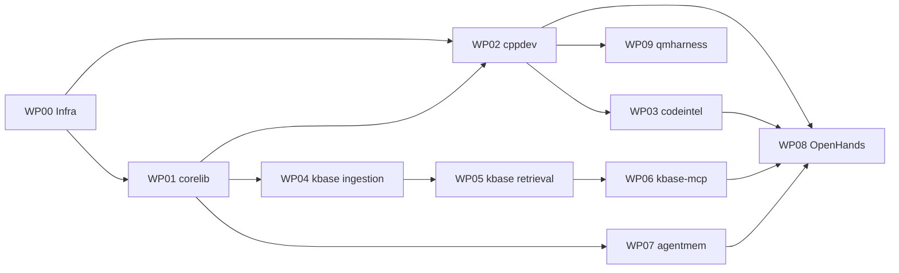

# Blueprint d'implémentation — index

Ce dossier contient la **spécification d'implémentation détaillée** du projet.
Il est écrit pour être lu par des agents de code **sans contexte préalable**.

> **Distinction fondamentale**
>
> - **Le produit** = le repo C++ [`quant-modeling`](https://github.com/HadrienT/quant-modeling) :
>   bibliothèque de pricing de dérivés. C'est ce qu'on construit.
> - **L'atelier** = ce repo `AgenticEnv` : l'environnement agentique qui aide à le
>   construire. C'est un moyen, pas une fin.
>
> Voir [10-TARGET-REPO.md](10-TARGET-REPO.md) pour l'état des lieux et la feuille de
> route du produit.

`SYNTHESE-PROJET.md` (racine du repo) est le document de vision. **Il n'est pas
nécessaire de le lire pour implémenter.** Tout ce qui est nécessaire est ici.

---

## Règle de lecture

**Tout agent lit `00-PRIMER.md` en premier.** Ensuite, uniquement les fichiers
listés en tête de son work package.

---

## Documents transverses

| Fichier | Contenu | Lire si… |
|---|---|---|
| [00-PRIMER.md](00-PRIMER.md) | Contexte, décisions verrouillées, interdits | **toujours** |
| [01-ARCHITECTURE.md](01-ARCHITECTURE.md) | Composants, frontières, dependency graph, topologie runtime, ports | vous touchez à plusieurs composants |
| [02-REPOSITORY-TREE.md](02-REPOSITORY-TREE.md) | Arborescence complète + responsabilité fichier par fichier | vous créez des fichiers |
| [03-INTERFACES.md](03-INTERFACES.md) | Contrats inter-packages (signatures, aucun corps) | vous implémentez un package |
| [04-DATA-MODEL.md](04-DATA-MODEL.md) | Schémas PostgreSQL, ER, index, migrations | vous touchez la base |
| [05-SEQUENCES.md](05-SEQUENCES.md) | Diagrammes de séquence bout-en-bout | vous câblez deux composants |
| [06-CONFIG.md](06-CONFIG.md) | Référence de configuration, registre de modèles, changement de contexte | vous ajoutez un paramètre |
| [07-ERRORS-AND-LOGGING.md](07-ERRORS-AND-LOGGING.md) | Taxonomie d'erreurs, contrat de logging et d'observabilité | vous levez/attrapez une erreur |
| [08-TESTING.md](08-TESTING.md) | Stratégie de test, invariants, fixtures, CI | **toujours avant de coder** |
| [09-CONVENTIONS.md](09-CONVENTIONS.md) | Conventions de code, unités, nommage, Definition of Done | **toujours avant de coder** |
| [10-TARGET-REPO.md](10-TARGET-REPO.md) | **Le produit** : état des lieux de `quant-modeling`, écarts, feuille de route (dates, timelines, AAD) | vous travaillez sur le repo C++ |

---

## Work packages

Chaque WP est **autonome** : il rappelle son contexte, ses dépendances, ses
livrables, ses critères d'acceptation. Ils sont ordonnés par dépendance.

| WP | Titre | Dépend de | Parallélisable avec |
|---|---|---|---|
| [WP00](wp/WP00-infrastructure.md) | Infrastructure & runtime (llama.cpp, systemd, Docker, PostgreSQL, sandbox) | — | — |
| [WP01](wp/WP01-corelib.md) | `corelib` — noyau partagé (config, logging, erreurs, DB, unités) | — | WP00 |
| [WP02](wp/WP02-cpp-toolchain.md) | `cppdev` — toolchain C++ : build, tests, sanitizers, diagnostics condensés | WP00, WP01 | WP04 |
| [WP03](wp/WP03-code-intelligence.md) | `codeintel` — intelligence de code C++ (clangd) — **le plus critique** | WP02 | WP06 |
| [WP04](wp/WP04-kbase-ingestion.md) | `kbase.ingestion` — pipeline documentaire | WP01, WP00 | WP02 |
| [WP05](wp/WP05-kbase-retrieval.md) | `kbase.retrieval` — recherche hybride + reranking | WP04 | — |
| [WP06](wp/WP06-kbase-mcp.md) | `kbase_mcp` — exposition MCP du RAG | WP05 | WP03 |
| [WP07](wp/WP07-agentmem.md) | `agentmem` + `agentmem_mcp` — mémoire épisodique & procédurale | WP01 | WP05 |
| [WP08](wp/WP08-openhands-integration.md) | Intégration OpenHands, profils d'agents, MCP wiring, Git checkpoints | WP02, WP03, WP06 | — |
| [WP09](wp/WP09-numerical-harness.md) | `qmharness` — non-régression numérique via les bindings pybind11 existants | WP02 | WP08 |

> `wp/_archive/` contient trois WP abandonnés (moteur quant Python `quantlab` et son
> MCP, `evalkit`). Ils partaient du principe erroné qu'il fallait **réimplémenter** un
> moteur de pricing. Le moteur existe déjà : c'est `quant-modeling`. Conservés pour
> trace, **à ne pas implémenter**.

---

## Ordre d'exécution recommandé

**Chemin critique minimal pour être productif** : WP00 → WP02 → WP03 → WP08.
Avec ces quatre WP, l'agent peut déjà travailler utilement sur le repo C++.
WP09 vient juste après (filet de sécurité numérique). Le RAG (WP04–WP06) et la
mémoire (WP07) sont des accélérateurs, pas des prérequis.

---

## Ce que ce blueprint ne fait PAS

- Il ne contient **aucune implémentation**. Uniquement des signatures, schémas,
  contrats et diagrammes.
- Il ne fige pas les détails d'API tierces (OpenHands, MCP SDK, drivers NVIDIA).
  Les points marqués `[À CONFIRMER]` doivent être vérifiés dans la documentation
  officielle **au moment de l'implémentation**, jamais devinés.

---

## Correctif de périmètre — table de substitution

Une première version du blueprint prévoyait de **réimplémenter** un moteur de pricing
en Python (`quantlab`). C'était une erreur : le moteur existe déjà en C++.

Les documents transverses `01` à `09` contiennent encore des références résiduelles.
Appliquer mentalement cette substitution en les lisant :

| Ancien | Nouveau |
|---|---|
| `quantlab` (moteur Python) | **supprimé** — le moteur est `quant-modeling` en C++ |
| `quantlab_mcp`, outils `quant.*` | `cppdev` + `codeintel` + `qmharness` et leurs MCP |
| `evalkit` | `qmharness` (§9 traite l'évaluation RAG/agent) |
| profil `quant` (agents) | profil `cpp-dev` |
| `configs/quantlab.yaml` | `configs/cppdev.yaml` + `configs/qmharness.yaml` |
| port `8201` `mcp-quantlab` | `8201` `mcp-cppdev`, `8204` `mcp-codeintel`, `8205` `mcp-qmharness` |

**Restent valides sans changement** : `corelib`, `kbase`, `agentmem`, l'infrastructure,
la taxonomie d'erreurs, les conventions, le modèle de données, la stratégie de test
(hors §3 de `08-TESTING.md`, qui devient la responsabilité du repo C++).
