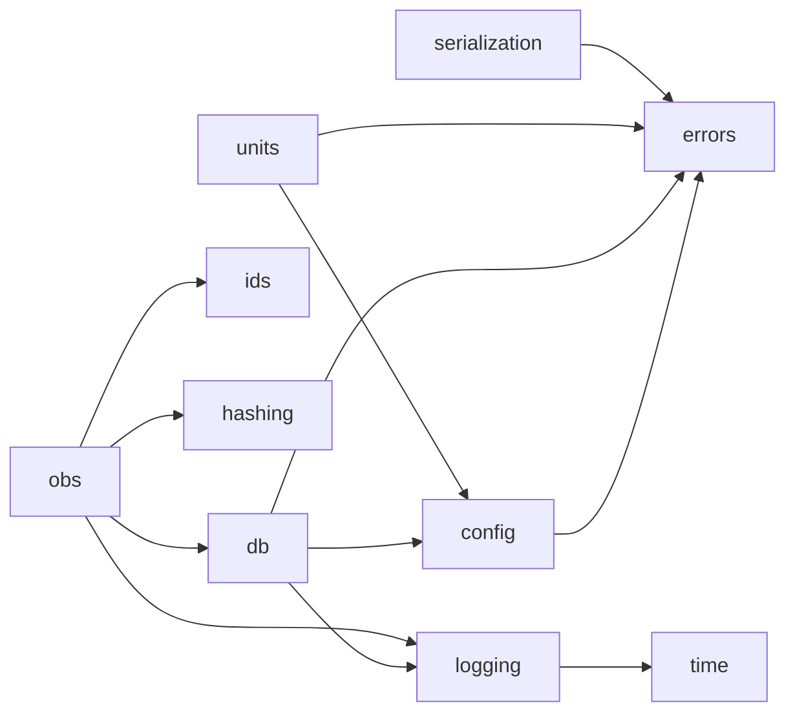

# WP01 — `corelib` (noyau partagé)

> **Contexte** : plateforme locale d'agents IA pour le pricing de dérivés. Monorepo
> Python 3.12 géré par `uv`. Quatre bibliothèques de domaine (`quantlab`, `kbase`,
> `agentmem`, `evalkit`) et trois serveurs MCP s'appuient sur `corelib`.
> Base de données : **PostgreSQL + pgvector + FTS**, bind `127.0.0.1`.
>
> `corelib` est le **seul** package qui lit la configuration, ouvre une session base,
> définit les erreurs et le logging. Il **ne dépend d'aucun autre package du repo**.

**Fichiers à lire** : ce fichier · [03-INTERFACES.md](../03-INTERFACES.md) §1 ·
[06-CONFIG.md](../06-CONFIG.md) · [07-ERRORS-AND-LOGGING.md](../07-ERRORS-AND-LOGGING.md) ·
[09-CONVENTIONS.md](../09-CONVENTIONS.md)

**Dépend de** : rien (WP00 en parallèle). **Bloque** : WP02, WP04, WP07, WP09.

---

## 1. Objectif

Fournir un socle minimal, stable et sans métier : configuration, logging structuré,
taxonomie d'erreurs, accès base, unités, identifiants, hachage, horloge,
sérialisation, enregistrement des invocations d'outils.

**`corelib` est volontairement petit.** Tout ce qui est spécifique à un domaine n'y
appartient pas.

---

## 2. Modules & responsabilités

| Module | Responsabilité | Ne contient pas |
|---|---|---|
| `config.py` | Modèles de settings, chargement `.env` + YAML, singleton, validation | valeurs métier |
| `logging.py` | Logger JSON structuré, `correlation_id` contextuel | métriques |
| `errors.py` | Taxonomie `AppError` et sous-classes, `ErrorDTO` | messages métier |
| `db.py` | Engine, `session_scope`, health, application des migrations | modèles ORM métier |
| `obs.py` | `ToolInvocation`, `record_tool_invocation`, `timed` | agrégation, dashboards |
| `units.py` | `Rate`, `Vol`, `Year` + `as_rate` / `as_vol` / `as_year` avec bornes de sanité | formules financières |
| `ids.py` | Identifiants triables (ULID/UUIDv7), clés déterministes | — |
| `hashing.py` | `sha256_file`, `sha256_obj`, `args_sha` | — |
| `time.py` | `utc_now()`, horloge injectable pour les tests | fuseaux métier |
| `serialization.py` | Encodeurs JSON (Decimal, date, vecteurs), DTO ↔ dict | schémas MCP |

---

## 3. Graphe d'appel interne



Aucune dépendance inverse. `errors` et `time` ne dépendent de rien.

---

## 4. Contrats clés

### 4.1 Configuration

- `get_settings()` : singleton, thread-safe, **lève `ConfigError`** si une variable
  requise manque. Pas de valeur de secours silencieuse.
- `load_yaml_config(name, model)` : charge `configs/<name>.yaml`, valide contre le
  modèle pydantic fourni par le package appelant. `corelib` ne connaît pas les
  schémas métier — il reçoit le type.
- Les secrets sont des `SecretStr` et ne sont **jamais** sérialisés.

### 4.2 Base de données

- `session_scope()` : context manager, commit en sortie normale, rollback sur
  exception, fermeture garantie.
- `check_health()` : `SELECT 1` + version de migration appliquée.
- `apply_migrations()` : applique les fichiers de `migrations/` dans l'ordre,
  idempotent, table `public.schema_migrations`. **Forward-only.**
- `statement_timeout` positionné depuis la configuration à l'ouverture de session.

### 4.3 Unités — le garde-fou

`as_rate(3.0)` lève `ValidationError` : un taux de 300 % est presque certainement
une saisie en pourcents. Les bornes viennent de `configs/quantlab.yaml → sanity`,
chargées par l'appelant et passées à `corelib`, ou lues via un accesseur dédié.

> Détail d'implémentation à trancher au moment du codage : soit `units` lit les
> bornes via `load_yaml_config`, soit elles sont passées en paramètre. **La seconde
> option est préférable** (garde `corelib` sans connaissance métier).

### 4.4 Observabilité

`record_tool_invocation` :
- ne lève **jamais** ; en cas d'échec de persistance, log `WARNING` et retour ;
- tronque/hache les arguments volumineux ;
- refuse d'écrire un champ marqué secret.

---

## 5. Migrations livrées par ce WP

```text
migrations/0001_extensions.sql   -- vector, pg_trgm, unaccent, schema_migrations
migrations/0005_schema_obs.sql   -- obs.tool_invocations
```

Les autres schémas (`kb`, `mem`, `eval`, `quant`) sont livrés par leurs WP respectifs.

---

## 6. Tests attendus

| Test | Attendu |
|---|---|
| Config manquante | `ConfigError` explicite nommant la variable |
| Priorité de configuration | env > YAML > défaut |
| Secret non sérialisé | `model_dump()` ne révèle pas la valeur |
| `session_scope` | rollback effectif sur exception |
| Migrations | application sur base vide → schéma attendu ; réapplication → no-op |
| `as_rate(3.0)` | `ValidationError` |
| `as_rate(0.03)` | OK |
| `as_vol(-0.1)` | `ValidationError` |
| `utc_now` | aware, UTC ; horloge substituable en test |
| `record_tool_invocation` avec base down | ne lève pas, log WARNING |
| `correlation_id` | présent dans tous les logs du bloc |
| Sérialisation | Decimal, date, vecteur → JSON stable |

---

## 7. Critères d'acceptation

- [ ] Aucun autre package du repo n'est importé par `corelib` (règle D1 vérifiée par `import-linter`).
- [ ] `mypy --strict` passe.
- [ ] `.env.example` liste **toutes** les variables de [06-CONFIG.md](../06-CONFIG.md) §3.
- [ ] `apply_migrations()` fonctionne sur base vide et sur base à jour.
- [ ] Aucun secret n'apparaît dans une sortie de log en test.
- [ ] `justfile` expose `just migrate`, `just lint`, `just test`.
