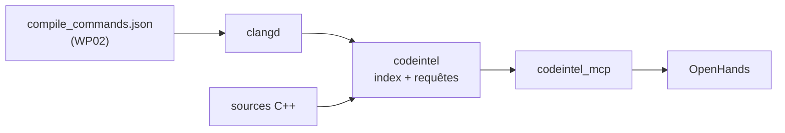

# WP03 — `codeintel` : intelligence de code C++

> **Contexte** : `AgenticEnv` est un atelier agentique dont le produit cible est le
> repo C++ `quant-modeling` (bibliothèque de pricing : ~26 instruments, 8 modèles,
> moteurs Analytic/MC/PDE/Tree, patron visiteur, registry, noyaux templatés,
> bindings pybind11). Le LLM local dispose de **32768 tokens de contexte**.
>
> **Ce work package est le plus critique de l'atelier.** Sans lui, l'agent ne peut
> pas travailler sur un repo de cette taille.

**Fichiers à lire** : ce fichier · [10-TARGET-REPO.md](../10-TARGET-REPO.md) §1 ·
[03-INTERFACES.md](../03-INTERFACES.md) §6 · [WP02](WP02-cpp-toolchain.md) §5 (`compile_commands.json`)

**Dépend de** : WP02. **Bloque** : WP08.

---

## 1. Le problème, chiffré

| Fait | Conséquence |
|---|---|
| Le repo cible contient des centaines de fichiers `.hpp`/`.cpp` | il ne rentre pas dans 32K tokens, même partiellement |
| Un seul header d'engine inclut 10+ autres headers | lire un fichier « pour comprendre » en tire 10 autres |
| Patron visiteur : `accept` / `visit` dispersés | `grep` ne donne pas la relation instrument → engine |
| Templates et surcharges | `grep "price"` retourne des centaines de faux positifs |
| 26 `InstrumentKind` × 8 `ModelKind` × 5 `EngineKind` dans un registry | la couverture réelle n'est pas lisible sans analyse |

**Sans intelligence de code, un agent sur ce repo procède par `grep` + lecture de
fichiers entiers, sature son contexte en 3 tours, et hallucine des signatures.**

La solution n'est pas d'agrandir le contexte : c'est de donner à l'agent des
**réponses ciblées à des questions structurelles**.

---

## 2. Approche

Adosser un serveur MCP à **clangd** (LSP), alimenté par le `compile_commands.json`
produit par WP02. Compléter par un index statique léger pour les questions que LSP
ne couvre pas (graphe d'inclusion, matrice du registry).



> `[À CONFIRMER]` Le mode d'interaction avec clangd (protocole LSP en sous-processus,
> ou `clangd --index-file`) est à valider à l'implémentation. Le contrat des outils
> ci-dessous ne doit pas en dépendre.

---

## 3. Catalogue d'outils MCP

| Outil | Question à laquelle il répond | Timeout |
|---|---|---|
| `code.find_symbol` | « Où est défini `BSEuroAsianMCEngine` ? » | 15 s |
| `code.definition` | « Définition de ce symbole, avec sa signature seule » | 15 s |
| `code.references` | « Qui appelle / utilise ce symbole ? » | 30 s |
| `code.implementations` | « Quelles classes dérivent de `EngineBase` ? » | 30 s |
| `code.outline` | « Structure d'un fichier : classes, méthodes, signatures — **sans les corps** » | 15 s |
| `code.signature` | « Signature exacte de cette fonction, sans lire le fichier » | 10 s |
| `code.callers` / `code.callees` | graphe d'appel local, profondeur bornée | 30 s |
| `code.includes` | graphe d'inclusion d'un fichier, entrant et sortant | 15 s |
| `code.grep` | recherche textuelle **filtrée sémantiquement** (exclut commentaires/chaînes si demandé) | 20 s |
| `code.registry_matrix` | matrice `(InstrumentKind, ModelKind, EngineKind)` réellement enregistrée | 30 s |
| `code.diff_context` | pour un diff Git, les symboles impactés et leurs utilisateurs | 30 s |

---

## 4. La règle qui gouverne tout : économie de contexte

| # | Règle |
|---|---|
| C1 | **Jamais de fichier entier par défaut.** `code.outline` renvoie la structure ; les corps sont exclus. |
| C2 | `code.definition` renvoie la **signature + la doc**, pas l'implémentation, sauf `include_body: true` explicite. |
| C3 | Toute réponse est bornée en nombre de résultats et en octets, avec compteur d'omission. |
| C4 | Les résultats sont **triés par pertinence**, pas par ordre alphabétique ou de fichier. |
| C5 | Chaque résultat porte `file:line` : l'agent peut demander l'extrait précis s'il en a besoin. |
| C6 | Un extrait de code est renvoyé avec un contexte de N lignes configurable, jamais plus. |
| C7 | Les chemins sont relatifs au workspace. |

**Métrique d'acceptation** : répondre à « quels engines gèrent `AsianOption` et quelle
est leur signature » doit coûter **moins de 500 tokens**, contre plusieurs milliers en
lisant les fichiers.

---

## 5. `code.registry_matrix` — outil spécifique au repo cible

Le repo dispatche via `PricingRegistry` sur un triplet. La couverture réelle n'est
lisible nulle part : elle est répartie entre `registry.cpp` et les `adapters/`.

Cet outil produit la matrice effective :

```jsonc
{
  "entries": [
    {"instrument": "EquityAsianOption", "model": "BlackScholes",
     "engine": "MonteCarlo", "adapter": "src/pricers/adapters/equity_asian.cpp"},
    {"instrument": "EquityAsianOption", "model": "BlackScholes",
     "engine": "Analytic", "adapter": "..."}
  ],
  "missing_combinations": [
    {"instrument": "EquityBarrierOption", "model": "DupireLocalVol", "engine": "PDE"}
  ]
}
```

**Valeur directe** : l'agent sait immédiatement ce qui existe, ce qui manque, et où
brancher un nouveau produit. C'est aussi un outil de revue : les combinaisons
déclarées mais non enregistrées sont des bugs latents.

> Extraction par analyse de l'AST via clangd/libclang, **jamais par expression
> régulière** sur les sources : le registry est peuplé dynamiquement.

---

## 6. Gestion de l'index

| # | Règle |
|---|---|
| I1 | L'index est **persistant** dans un volume dédié. Le reconstruire à chaque session est rédhibitoire. |
| I2 | Mise à jour **incrémentale** sur modification de fichier. |
| I3 | `compile_commands.json` obsolète ⇒ avertissement explicite dans `meta`, pas de réponse silencieusement fausse. |
| I4 | Index absent ou corrompu ⇒ `DEPENDENCY_ERROR`, **jamais** de repli silencieux sur `grep`. |
| I5 | L'indexation initiale est une opération longue, annoncée, avec progression journalisée. |
| I6 | L'index ne contient aucun secret ; il ne quitte pas le host. |

---

## 7. Ce que cet outil rend possible

Cas d'usage réels sur `quant-modeling` :

| Tâche | Sans `codeintel` | Avec |
|---|---|---|
| Ajouter un produit | lire 8 fichiers pour comprendre le patron | `code.outline` sur un produit voisin + `code.registry_matrix` |
| Migrer `Real T` → `Date` (Phase B) | impossible à cadrer | `code.references` sur le symbole, liste exhaustive des sites |
| Templater les noyaux pour l'AAD (Phase C) | risque d'oubli | `code.callers` sur le noyau, périmètre exact |
| Vérifier qu'un refactor est complet | espoir | `code.references` avant/après |
| Comprendre le patron visiteur | lecture de `base.hpp` + tous les engines | `code.implementations` sur `IInstrumentVisitor` |

> La **Phase B** de [10-TARGET-REPO.md](../10-TARGET-REPO.md) (migration temporelle sur
> 26 instruments) est infaisable de façon fiable sans `code.references`. C'est la
> justification principale de ce work package.

---

## 8. Tests

| Test | Attendu |
|---|---|
| `find_symbol` sur une classe connue | fichier et ligne exacts |
| `references` | exhaustif sur un symbole de test, aucun faux positif de commentaire |
| `implementations` | toutes les classes dérivées trouvées, y compris en templates |
| `outline` | aucune ligne de corps de fonction dans la sortie |
| Bornage | grand nombre de références ⇒ tronqué + compteur correct |
| Budget de tokens | scénario de référence (§4) sous le seuil |
| `registry_matrix` | correspond au registry réel ; combinaisons manquantes correctes |
| Index obsolète | avertissement, pas de résultat faux silencieux |
| Index absent | `DEPENDENCY_ERROR`, pas de repli `grep` |
| Incrémental | modification d'un fichier ⇒ index à jour sans reconstruction complète |
| Chemins | relatifs au workspace |

---

## 9. Critères d'acceptation

- [ ] Index construit sur `quant-modeling` réel.
- [ ] Les 11 outils répondent.
- [ ] Le scénario de référence coûte moins de 500 tokens.
- [ ] `code.references` est exhaustif sur un symbole transverse (`Real`, `PricingSettings`).
- [ ] `code.registry_matrix` reflète le registry réel et liste les combinaisons manquantes.
- [ ] Index persistant entre redémarrages, mise à jour incrémentale fonctionnelle.
- [ ] Aucun repli silencieux en cas d'index indisponible.
- [ ] `mypy --strict` passe.

---

## 10. Pièges

| Piège | Conduite à tenir |
|---|---|
| Renvoyer des fichiers entiers | violation de C1 ; c'est le mode d'échec principal |
| Repli sur `grep` quand l'index est absent | produit des réponses fausses avec l'apparence de la justesse — interdit |
| Index reconstruit à chaque session | volume persistant obligatoire |
| Extraction du registry par regex | faux dès que l'enregistrement est indirect |
| Ignorer les instanciations de templates | `references` incomplet sur les noyaux templatés — vérifier explicitement |
| `compile_commands.json` désynchronisé | régénérer via `cpp.configure` avant indexation |
