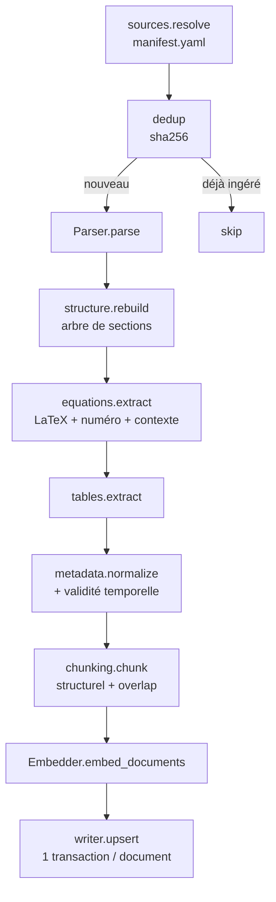

# WP04 — `kbase.ingestion` (pipeline documentaire)

> **Contexte** : plateforme locale d'agents IA pour le pricing de dérivés. Le LLM
> local ne doit pas « savoir » la littérature quantitative : il doit la **retrouver**.
> Ce work package construit la base de connaissance à partir de documents
> scientifiques (papers, livres, documentation).
>
> Stockage : **PostgreSQL + pgvector + Full Text Search**. Pas de Qdrant, pas
> d'OpenSearch. Corpus initial : **20 à 50 documents extrêmement pertinents**, pas
> davantage. La taille du corpus n'augmente qu'avec la qualité du pipeline.

**Fichiers à lire** : ce fichier · [03-INTERFACES.md](../03-INTERFACES.md) §3 ·
[04-DATA-MODEL.md](../04-DATA-MODEL.md) §3 · [05-SEQUENCES.md](../05-SEQUENCES.md) §4 ·
[06-CONFIG.md](../06-CONFIG.md) §4 (`configs/kbase.yaml`)

**Dépend de** : WP01, WP00 (PostgreSQL). **Bloque** : WP05.

---

## 1. Objectif

Transformer un document source en chunks indexés, avec structure, équations,
metadata et **provenance complète**, de façon idempotente et transactionnelle.

---

## 2. Le piège central à éviter

```text
PDF -> raw text   ← INTERDIT
```

Les documents quantitatifs contiennent des **équations, tableaux, figures,
références, numéros d'équation, sections**. Perdre cette structure rend le RAG
inutilisable pour ce domaine. Le parsing est la partie la plus importante du WP.

---

## 3. Pipeline



---

## 4. Règles de chunking

| # | Règle |
|---|---|
| K1 | **Chunking structurel**, pas de découpage à taille fixe. Unité naturelle : section / sous-section / concept / équation + explication. |
| K2 | Une équation n'est **jamais** coupée. Elle est conservée avec son contexte textuel. |
| K3 | Un tableau n'est jamais coupé. |
| K4 | Overlap **contrôlé** (`overlap_tokens` en config). Trop d'overlap = stockage, bruit, duplication. |
| K5 | Chaque chunk porte : `document_version_id`, `section_id`, `ordinal`, `kind`, pages, `has_equations`, validité temporelle, `sha256`. |
| K6 | Un chunk qui dépasse `max_tokens` est découpé au dernier point de coupe **licite** (jamais au milieu d'une équation). |
| K7 | Le titre de section est concaténé au texte indexé (poids `A` du `tsvector`), mais pas au contenu retourné. |

---

## 5. Équations — données de première classe

Pour chaque équation, conserver : `latex`, `equation_number`, `page`, `symbols[]`,
`context_before`, `context_after`, rattachement au chunk et au document.

> Une équation isolée n'a pas toujours de sens. Le contexte est indispensable pour
> qu'un agent puisse répondre « d'où vient cette formule et sous quelles hypothèses ».

`symbols[]` alimente un index GIN : c'est ce qui permet de retrouver un chunk par
`κ`, `θ`, `ρ`, `v₀`.

---

## 6. Metadata & provenance

Metadata minimales par document : `doc_key`, `title`, `authors[]`, `year`,
`doc_type`, `topic`, `asset_class`, `source_url`, `license`.

Provenance obligatoire par chunk : document, auteurs, année, page, section,
numéro d'équation, `sha256`, source, date d'ingestion.

**Invariant** : si `provenance.assert_complete()` échoue pour un chunk, le document
est rejeté avec une erreur explicite. Un chunk sans provenance n'entre pas en base.

### Temporalité

| Régime | Exemples | `valid_until` |
|---|---|---|
| Stable | Itô, Black-Scholes, Heston, SABR, Monte Carlo, PDE | `NULL` |
| Semi-stable | méthodes numériques, conventions de marché, implémentations | souvent `NULL` |
| Très dynamique | SOFR, réglementation, ISDA, règles de marge | date explicite |

`valid_from` / `valid_until` / `source_date` sont renseignés par `metadata.normalize`
à partir du manifeste et du document.

---

## 7. `documents/manifest.yaml` — source de vérité du corpus

```yaml
documents:
  - doc_key: <slug stable>
    path: raw/<fichier>.pdf
    title: <titre>
    authors: [<auteur>]
    year: <année>
    doc_type: research_paper
    topic: <thème>
    asset_class: <classe>
    source_url: <url>
    license: <licence>
    sha256: <hash>
    valid_from: null
    valid_until: null
```

Le manifeste est **versionné dans Git**. Les fichiers `raw/` ne le sont pas.
`sha256` sert à la fois à l'idempotence et à la vérification d'intégrité.

---

## 8. Garanties d'exécution

| Garantie | Détail |
|---|---|
| **Idempotence** | Même `sha256` ⇒ no-op. Compteurs inchangés au second passage. |
| **Transactionnalité** | Une transaction par document. Aucun chunk partiel ne subsiste. |
| **Isolation d'échec** | Un document en échec n'interrompt pas le run. Il est consigné dans `errors[]`, le run finit en `partial`. |
| **`dry_run`** | Exécute tout sauf l'écriture, produit le rapport complet. |
| **Traçabilité** | `kb.ingestion_runs` enregistre compteurs, durée, erreurs, hash de configuration. |
| **Reprise** | Relancer après échec ne duplique rien. |

---

## 9. Embeddings

- `Embedder` est un `Protocol` (WP04 fournit une implémentation locale).
- La **dimension** est déclarée dans `configs/kbase.yaml` et **doit** correspondre au
  `vector(D)` de la migration. Vérification au démarrage : incohérence ⇒ refus de
  démarrer (`ConfigError`).
- Batching, taille en configuration.
- Changer de modèle d'embedding ⇒ nouvelle migration + **réindexation complète**.
  Prévoir la commande `kbase reindex --model <name>`.
- `kb.chunk_embeddings` a une PK composite `(chunk_id, model_name, model_version)` :
  plusieurs modèles peuvent coexister pendant une migration.

---

## 10. CLI

```text
kbase ingest   --source manifest [--force-reparse] [--dry-run]
kbase reindex  --model <name>
kbase stats
kbase verify                # provenance complète, orphelins, cohérence dim
```

---

## 11. Migrations livrées

`migrations/0002_schema_kb.sql` : `kb.documents`, `kb.document_versions`,
`kb.sections`, `kb.chunks` (+ `search_tsv` et son trigger), `kb.chunk_embeddings`,
`kb.equations`, `kb.tables`, `kb.ingestion_runs`, `kb.retrieval_logs`, index.

Configuration FTS : **`simple`**, sans stemming — le stemming anglais casse `SABR`,
`SOFR`, `CVA`. À confirmer par les tests de WP05.

---

## 12. Tests

| Test | Attendu |
|---|---|
| Idempotence | second passage : 0 document ingéré |
| Transactionnalité | échec simulé pendant l'écriture ⇒ aucun résidu |
| Isolation | 1 document sur 5 en échec ⇒ 4 ingérés, run `partial` |
| Équations | jamais coupées ; LaTeX identique à la source ; `symbols[]` renseigné |
| Chunking | tailles et overlap conformes à la policy |
| Provenance | `assert_complete` passe pour 100 % des chunks écrits |
| Temporalité | `valid_from`/`valid_until` propagés |
| Dimension | `dim` ≠ base ⇒ `ConfigError` au démarrage |
| `dry_run` | aucune écriture, rapport identique |
| Corpus de test | fixture minimale versionnée dans `tests/fixtures/corpus/` |

---

## 13. Critères d'acceptation

- [ ] 20 à 50 documents réels ingérés depuis le manifeste.
- [ ] Réingestion complète = no-op.
- [ ] 100 % des chunks ont une provenance complète.
- [ ] Aucune équation coupée dans le corpus de test.
- [ ] `kbase verify` ne signale ni orphelin ni incohérence.
- [ ] `kbase stats` donne documents, chunks, équations, date de dernière ingestion.
- [ ] `mypy --strict` passe.

---

## 14. Sécurité

> Les documents ingérés sont **des données externes non fiables**. Un PDF peut
> contenir du texte conçu pour détourner un agent (injection de prompt).

| Règle |
|---|
| Le contenu d'un chunk n'est jamais traité comme une instruction. WP05/WP06 l'encadrent comme contenu cité. |
| Aucun parsing ne doit exécuter de code embarqué dans le document. |
| Validation stricte des chemins : lecture confinée à `paths.documents_dir` (anti path traversal). |
| Limite de taille de fichier et timeout de parsing. |
