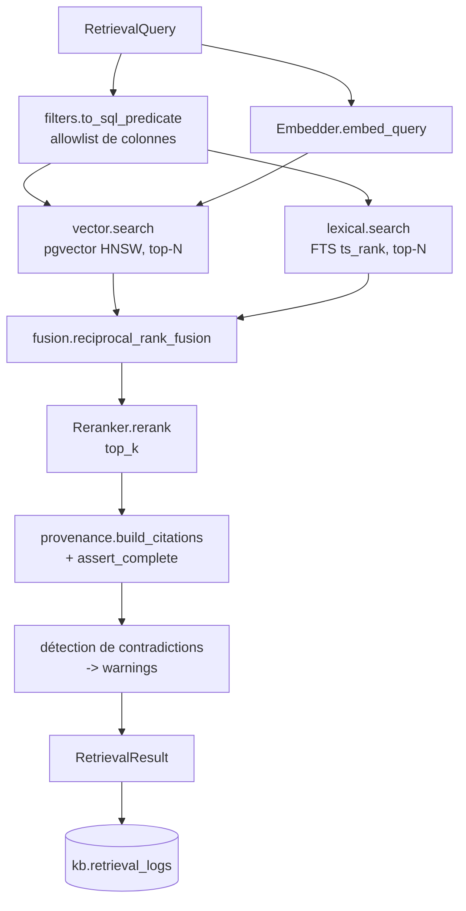

# WP05 — `kbase.retrieval` (recherche hybride)

> **Contexte** : plateforme locale d'agents IA pour le pricing de dérivés. La base de
> connaissance (WP04) contient des chunks de papers et de documentation quantitative,
> avec équations, metadata et provenance, dans **PostgreSQL + pgvector + FTS**.
> Ce work package construit la couche de recherche.
>
> **Décision structurante** : en finance quantitative, la recherche purement
> vectorielle est insuffisante. Les requêtes sont très lexicales : `SABR`, `SOFR`,
> `CVA`, `PFE`, `OIS`, `κ`, `θ`, `ρ`, `condition de Feller`. Il faut
> **vector + FTS + filtres metadata + reranker**.

**Fichiers à lire** : ce fichier · [03-INTERFACES.md](../03-INTERFACES.md) §3 ·
[04-DATA-MODEL.md](../04-DATA-MODEL.md) §3 et §6 · [05-SEQUENCES.md](../05-SEQUENCES.md) §3 ·
[06-CONFIG.md](../06-CONFIG.md) §4

**Dépend de** : WP04. **Bloque** : WP06, WP09.

---

## 1. Objectif

Un point d'entrée unique — `HybridRetriever.retrieve(RetrievalQuery)` — qui renvoie
des chunks pertinents, ordonnés, **avec citation complète** et diagnostics.

---

## 2. Pipeline



---

## 3. Les trois branches

| Branche | Implémentation | Rôle |
|---|---|---|
| **Vectorielle** | `pgvector`, index HNSW, distance cosinus | paraphrases, questions conceptuelles |
| **Lexicale** | `tsvector` + `ts_rank`, configuration `simple` | sigles, symboles grecs, noms de modèles, numéros d'équation |
| **Filtres** | `WHERE` sur `doc_type`, `topic`, `asset_class`, `year`, validité temporelle, `doc_keys`, `has_equations` | ciblage, fraîcheur |

`candidates_vector` et `candidates_lexical` (par défaut 50 chacun) sont configurables.

---

## 4. Fusion

**Reciprocal Rank Fusion (RRF)** :

$$\text{score}(d) = \sum_{b \in \text{branches}} \frac{1}{k + \text{rank}_b(d)}$$

avec $k$ = `retrieval.rrf_k` (défaut 60).

Raison du choix : RRF ne nécessite aucune normalisation entre des scores de nature
différente (distance cosinus vs `ts_rank`), ce qui est exactement le problème ici.

Les scores individuels (`vector`, `lexical`, `fused`, `rerank`) sont **tous
conservés** dans `RetrievedChunk.scores` — indispensable pour le diagnostic et pour
l'évaluation du WP09.

---

## 5. Reranking

- `Reranker` est un `Protocol`. Implémentation locale (modèle cross-encoder).
- Activé par défaut (`retrieval.rerank.enabled`), désactivable par requête.
- **Dégradation documentée** : si le reranker est indisponible, le retrieval renvoie
  le résultat fusionné avec un `warning` explicite. Jamais d'échec silencieux, jamais
  de résultat prétendument reranké.
- Si un GPU est disponible pour le reranker, c'est l'option 1 de répartition GPU
  (modèle sur GPU 0, embeddings/reranker sur GPU 1) — à trancher par le benchmark WP00.

---

## 6. Filtres — sécurité

> **Aucune concaténation SQL.** Les filtres sont construits à partir d'une
> **allowlist de colonnes** et de valeurs paramétrées.

| Règle |
|---|
| `filters.to_sql_predicate()` refuse toute clé hors allowlist (`ValidationError`). |
| Les valeurs sont toujours passées en paramètres liés. |
| Un test dédié tente une injection SQL via chaque champ de filtre. |
| `valid_at` fourni ⇒ exclut les chunks dont `valid_until < valid_at`. |

---

## 7. Provenance & contradictions

### Provenance

Aucun `RetrievedChunk` ne quitte le package sans `Citation` complète.
`assert_complete()` lève sinon. Champs : document, auteurs, année, section, page,
numéro d'équation, `source_url`, `sha256`, date d'ingestion.

### Contradictions

Le corpus peut contenir des erreurs, des doublons, des papers contradictoires, des
conventions anciennes. Quand plusieurs chunks pertinents proviennent de sources
divergentes, le résultat porte un `warning` :

```text
Source A dit X / Source B dit Y
Différence : hypothèses ou conventions distinctes
Conclusion : utiliser X sous l'hypothèse A, Y sous l'hypothèse B
```

**Ce comportement est préférable à une réponse arbitraire.** Détection minimale en
phase 1 : plusieurs `doc_key` distincts dans le top-k sur un même concept ⇒ signalé.
Une détection sémantique fine est hors périmètre.

---

## 8. Journalisation

Chaque appel écrit dans `kb.retrieval_logs` : requête, filtres, stratégie, `k`,
latence, chunks retournés, scores, `correlation_id`.

Cette table sert directement à l'évaluation du RAG (WP09) et à la collecte de traces.

---

## 9. Tests — jeu doré obligatoire

Corpus de test versionné (`tests/fixtures/corpus/`) + requêtes avec chunks attendus.

| Test | Seuil / attendu |
|---|---|
| Requête lexicale pure (`SABR`, `SOFR`, `CVA`, `κ`) | chunk attendu dans le top-k — **c'est le test qui justifie l'existence du FTS** |
| Requête sémantique paraphrasée | chunk attendu dans le top-k |
| Hybride ≥ chaque branche isolée | MRR hybride ≥ max(MRR vector, MRR lexical) |
| Reranking | améliore le MRR sur le jeu doré |
| Filtres metadata | aucun résultat hors filtre |
| Filtre temporel | chunk expiré exclu si `valid_at` fourni |
| Injection SQL | rejetée par l'allowlist, aucune requête exécutée |
| Reranker indisponible | résultat fusionné + `warning`, pas d'exception |
| Embedder indisponible | `DEPENDENCY_ERROR` — **pas** de repli silencieux sur le lexical seul |
| Contradictions | deux chunks divergents ⇒ `warnings` non vide |
| Provenance | 100 % des résultats ont une citation complète |
| Zéro résultat | résultat vide valide, pas d'exception |

Seuil de référence initial : `recall@8 ≥ 0.80` sur le jeu doré
(`configs/evalkit.yaml → thresholds`).

---

## 10. Performance

| Règle |
|---|
| Vector et lexical s'exécutent **en parallèle**. |
| Aucune requête N+1 : les chunks et leurs metadata sont chargés en une requête. |
| Index HNSW obligatoire sur `kb.chunk_embeddings.embedding`. |
| Index GIN obligatoire sur `kb.chunks.search_tsv`. |
| Budget de latence cible : recherche hybride sans reranking < 200 ms sur le corpus initial. À mesurer, pas à supposer. |

---

## 11. Critères d'acceptation

- [ ] `HybridRetriever.retrieve()` est l'unique point d'entrée public.
- [ ] Les trois stratégies (`hybrid`, `vector`, `lexical`) fonctionnent.
- [ ] Le jeu doré passe les seuils configurés.
- [ ] L'hybride surpasse chaque branche isolée sur le jeu doré.
- [ ] Tous les résultats portent une citation complète.
- [ ] Les tentatives d'injection SQL sont rejetées.
- [ ] Les dégradations (reranker absent) sont signalées, jamais silencieuses.
- [ ] `kb.retrieval_logs` alimentée à chaque appel.
- [ ] `mypy --strict` passe.
