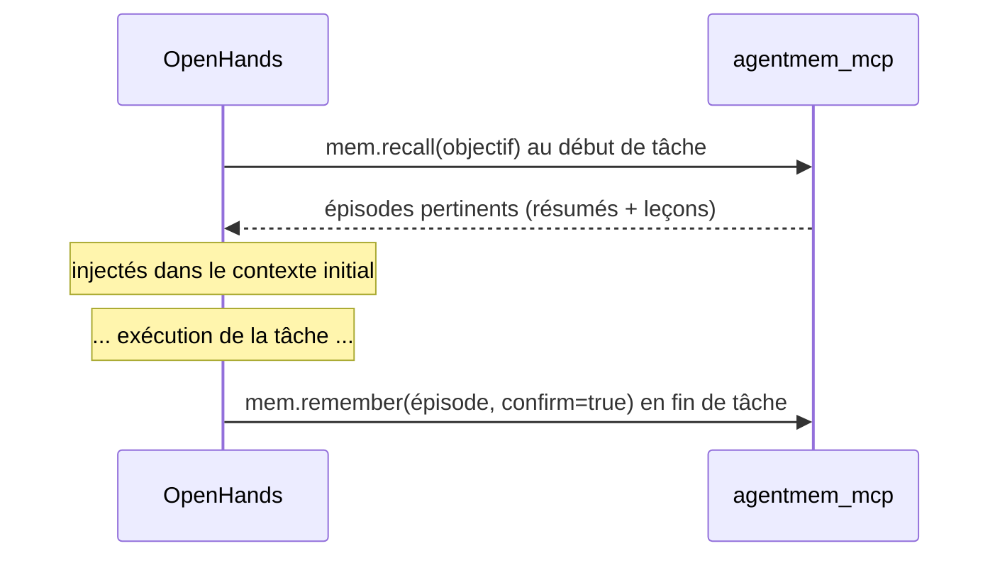

# WP07 — `agentmem` + `agentmem_mcp` (mémoire)

> **Contexte** : plateforme locale d'agents IA pour le pricing de dérivés. Le harness
> est **OpenHands**, qui gère déjà l'état de la tâche courante et l'historique de
> conversation. Ce work package ajoute ce qu'OpenHands ne fournit pas : une mémoire
> **persistante entre les tâches**.
>
> Stockage : **PostgreSQL + pgvector**. Pas de Redis, pas de base dédiée.

**Fichiers à lire** : ce fichier · [03-INTERFACES.md](../03-INTERFACES.md) §4 et §6 ·
[04-DATA-MODEL.md](../04-DATA-MODEL.md) §4 · [06-CONFIG.md](../06-CONFIG.md) §4

**Dépend de** : WP01. **Bloque** : WP08.

---

## 1. Les quatre mémoires — qui fait quoi

| Type | Contenu | Support | Qui l'implémente |
|---|---|---|---|
| **Working** | tâche courante, résultats récents, plan | contexte OpenHands | **OpenHands** — hors périmètre |
| **Episodic** | expériences passées : objectif, actions, résultat, leçon | `mem.episodes` | **ce WP** |
| **Semantic / long terme** | connaissance quantitative (Heston, SABR, MC, PDE…) | `kb.*` | **WP04/WP05** — pas ici |
| **Procedural** | recettes réutilisables (« comment calibrer SABR ») | Git + `mem.procedures` | **ce WP** |

> Ne pas dupliquer la connaissance documentaire dans la mémoire. Le RAG est la
> mémoire sémantique. `agentmem` stocke **l'expérience**, pas le savoir.

---

## 2. Mémoire épisodique

### Contenu d'un épisode

```text
episode_id · task_id · agent_profile · goal · started_at · ended_at
status (success | failure | partial | abandoned)
summary        <- texte court, c'est lui qui est embeddé
actions[]      <- outils appelés, résultats résumés, statuts
outcome        <- résultat structuré (params, rmse, prix, commit…)
lessons[]      <- ce qu'il faut retenir pour la prochaine fois
tags[] · branch · last_commit
```

Exemple de contenu attendu (forme, pas données) :

```text
Objectif  : calibrer Heston sur une surface
Actions   : recherche RAG, calibration moindres carrés, initialisation par
            évolution différentielle, polissage L-BFGS
Résultat  : RMSE = <valeur> points de vol
Problème  : initialisation instable
Leçon     : utiliser des bornes + plusieurs initialisations
```

### Règles

| # | Règle |
|---|---|
| A1 | `agentmem` **ne décide jamais** quoi mémoriser. C'est l'agent qui appelle `mem.remember`, ou un hook de fin de tâche (WP08). |
| A2 | `summary` et `lessons` sont obligatoires et non vides. Un épisode sans leçon n'a aucune valeur. |
| A3 | L'embedding porte sur `goal + summary + lessons`, pas sur la trace complète. |
| A4 | Aucun secret, aucun contenu de fichier, aucun chemin host dans un épisode. |
| A5 | Un épisode est **immuable** après écriture. Correction = nouvel épisode. |
| A6 | `recall` retourne des épisodes **résumés**, jamais la trace complète (budget de contexte). |

### `recall` — recherche hybride

```text
recall(query, k, tags, status)
 ├─ embed(query)
 ├─ recherche vectorielle sur mem.episodes.embedding (HNSW)
 ├─ filtre tags / status / profil
 ├─ seuil min_similarity (configs/agentmem.yaml)
 └─ retour trié, résumés uniquement
```

Le seuil est important : **mieux vaut ne rien retourner qu'un épisode hors sujet**,
qui pollue le contexte et induit l'agent en erreur.

---

## 3. Mémoire procédurale

### Source de vérité = Git

Les procédures vivent dans `agents/procedures/*.md` (ou `.yaml`), versionnées.
La table `mem.procedures` est un **cache interrogeable**, reconstruit par
`sync_from_git()`.

Raison : une procédure est du savoir-faire d'ingénierie. Elle doit être revue,
diffée, et faire partie du dépôt — pas être modifiable à chaud par un agent.

### Forme d'une procédure

```text
name · version · description
preconditions[]
steps[]           <- ordonnées, chacune avec objectif et vérification
postconditions[]
tags[]
```

Exemple de structure (« calibrer SABR ») : valider la surface d'entrée → calculer le
forward → poser les paramètres initiaux → appliquer les bornes → lancer l'optimiseur
→ vérifier le résidu → vérifier l'absence d'arbitrage → stocker la calibration.

### Règles

| # | Règle |
|---|---|
| A7 | Un agent peut **lire** les procédures, jamais les écrire via MCP. |
| A8 | `sync_from_git` est idempotent et s'exécute au démarrage si configuré. |
| A9 | Une procédure supprimée de Git est supprimée du cache. |

---

## 4. Serveur MCP

| Outil | Rôle | Écriture |
|---|---|---|
| `mem.recall` | Retrouver des expériences passées pertinentes | non |
| `mem.remember` | Enregistrer un épisode | **oui — `confirm: true` obligatoire** |
| `mem.list_procedures` | Lister les procédures disponibles | non |
| `mem.get_procedure` | Obtenir une procédure complète | non |

Mêmes règles que WP03/WP06 : zéro logique métier, enveloppe `{ok, data, error, meta}`,
timeouts, allowlist, `stdio` **et** `http`, bind `127.0.0.1:8203`, `GET /health`.

`mem.remember` valide que `summary` et `lessons` sont non vides, sinon
`VALIDATION_ERROR`.

---

## 5. Migration livrée

`migrations/0003_schema_mem.sql` : `mem.episodes` (+ index HNSW sur `embedding`,
GIN sur `tags`), `mem.episode_actions`, `mem.artifacts`, `mem.procedures`.

---

## 6. Où la mémoire est utilisée (câblage en WP08)



Le rappel en début de tâche est ce qui donne au système sa **continuité** : il évite
de refaire deux fois la même erreur de calibration.

---

## 7. Tests

| Test | Attendu |
|---|---|
| Épisode sans `lessons` | `VALIDATION_ERROR` |
| Immutabilité | tentative de mise à jour rejetée |
| `recall` pertinent | jeu de test : l'épisode attendu est dans le top-k |
| Seuil de similarité | requête hors sujet ⇒ résultat vide, pas de bruit |
| Filtres tags/status | respectés |
| Résumés uniquement | `recall` ne renvoie jamais la trace complète |
| Pas de secret | un épisode contenant un motif de secret est rejeté ou expurgé |
| `sync_from_git` | idempotent ; suppression dans Git ⇒ suppression du cache |
| Écriture procédure via MCP | impossible (aucun outil) |
| `mem.remember` sans `confirm` | `VALIDATION_ERROR` |

---

## 8. Critères d'acceptation

- [ ] Écriture et rappel d'épisodes fonctionnels, avec seuil de pertinence.
- [ ] Procédures synchronisées depuis Git, lecture seule côté agent.
- [ ] Aucun secret ni chemin host persistable dans un épisode.
- [ ] `mem.remember` exige `confirm: true`.
- [ ] Serveur MCP conforme au contrat commun, `GET /health` intégré au healthcheck.
- [ ] `mypy --strict` passe.

---

## 9. Ce qui est hors périmètre

- Compression / résumé automatique de contexte long : c'est OpenHands.
- Oubli automatique, décroissance temporelle : non implémenté en phase 1.
- Mémoire partagée entre plusieurs agents concurrents : le multi-agent n'existe pas encore.
