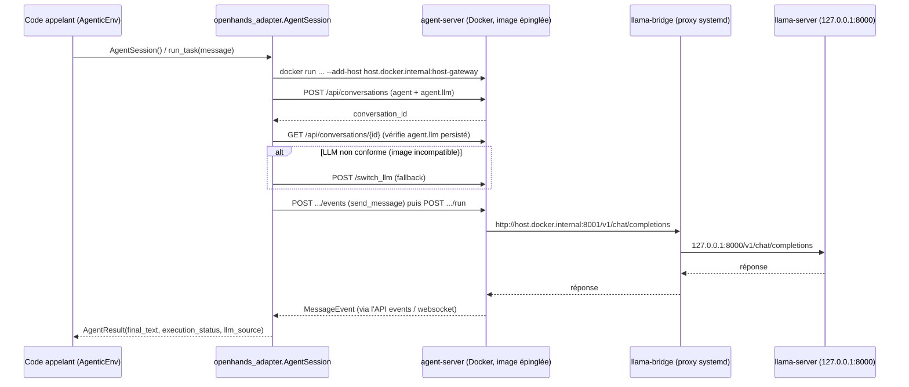

# WP08b — Intégration OpenHands, phase 2 : sandbox Docker via le SDK

> **Contexte** : plateforme locale d'agents IA pour le pricing de dérivés, sur serveur
> Debian avec 2 × V100. Le modèle est servi par **llama.cpp** sur
> `http://127.0.0.1:8000/v1` (OpenAI-compatible). WP08 a livré une intégration
> OpenHands en **CLI headless**, qui — constat documenté dans ce même WP — tourne
> **sans sandbox Docker** : `terminal`/`file_editor` s'exécutent comme sous-processus
> directs de l'utilisateur qui lance `openhands`, la seule frontière étant des hooks
> `PreToolUse` à refus dur plus la discipline OS. WP08 nomme explicitement ce choix
> « phase 1 » et renvoie l'isolation Docker à plus tard.
>
> **Ce WP est cette phase 2.** Il n'utilise pas le CLI headless mais le **SDK OpenHands**
> (`openhands-sdk`/`openhands-workspace`/`openhands-tools`) pour piloter un
> `agent-server` Dockerisé — un chemin de code entièrement différent, déjà identifié
> comme l'alternative dans WP08 §5 (« évaluer `openhands serve`/le GUI Docker »).

**Fichiers à lire** : ce fichier · [WP08-openhands-integration.md](WP08-openhands-integration.md)
(dépendance directe, notamment §5 et §9) · [01-ARCHITECTURE.md](../01-ARCHITECTURE.md) §1/§6 ·
[05-SEQUENCES.md](../05-SEQUENCES.md) §5/§6/§8 · [06-CONFIG.md](../06-CONFIG.md) §5

**Dépend de** : WP08. **Bloque** : rien — extension optionnelle. Un agent peut continuer
à utiliser le chemin CLI headless de WP08 sans ce WP.

> **État (2026-09-04) — implémenté et vérifié bout-en-bout.** Le paquet
> `openhands_adapter` est implémenté, testé (unitaire + e2e) et
> lint/mypy/import-linter passent. Le proxy `llama-bridge` (§5) est **déployé et
> actif** (`systemctl status llama-bridge.socket`). Le smoke test automatisé
> (`packages/openhands_adapter/tests/test_session_e2e.py`, `@pytest.mark.e2e`) est
> **vert** : conteneur `agent-server` démarré, LLM câblé via le chemin
> `create_payload` (§4, pas de `switch_llm` nécessaire), message « Réponds
> exactement : TEST_FINAL » envoyé, `final_text == "TEST_FINAL"` et
> `execution_status == "finished"` confirmés, conteneur proprement arrêté en fin de
> test. Aucune récidive de l'incident réseau du même jour (§13) sur l'ensemble des
> cycles démarrage/arrêt de conteneur rejoués pendant cette vérification.

---

## 1. Objectif

Obtenir un agent qui parle au LLM local **depuis un conteneur Docker isolé**
(`ghcr.io/openhands/agent-server`), sans exposer `llama-server` au-delà de
`127.0.0.1`, piloté par une API Python propre (`openhands_adapter`) plutôt que par
des appels REST manuels.

Ce que ça corrige par rapport à WP08 phase 1 :

| WP08 phase 1 (CLI headless) | WP08b (SDK + agent-server Docker) |
|---|---|
| Pas de sandbox : sous-processus direct de l'hôte | Sandbox Docker réelle (`AgenticEnvDockerWorkspace`) |
| Frontière = hooks `PreToolUse` à refus dur | Frontière = isolation conteneur (+ hooks encore possibles plus tard, voir §7) |
| LLM atteint directement en `127.0.0.1` (process hôte) | LLM atteint via `host.docker.internal` + un proxy dédié (§6) |
| `--llm-approve` indisponible en headless | `NeverConfirm()` explicite côté SDK — même sémantique, assumée |

---

## 2. Architecture



---

## 3. Le paquet `openhands_adapter`

```text
packages/openhands_adapter/
├── pyproject.toml                     # deps openhands-sdk/-workspace/-tools ÉPINGLÉES
├── src/openhands_adapter/
│   ├── __init__.py                    # façade : run_task, AgentSession, AgentResult,
│   │                                  # AgenticEnvDockerWorkspace, OpenHandsConfig
│   ├── py.typed
│   ├── config.py                      # OpenHandsConfig <- configs/openhands.yaml
│   ├── docker_workspace.py            # AgenticEnvDockerWorkspace(DockerWorkspace)
│   └── session.py                     # AgentSession / AgentResult / run_task / _ensure_llm
└── tests/
    ├── test_config.py                 # valide configs/openhands.yaml contre le modèle
    ├── test_workspace_flags.py        # construction des flags `docker run`, mocké
    └── test_session_e2e.py            # @pytest.mark.e2e, PAS joué en CI
```

**Règle de dépendance** : `openhands_adapter` est le **seul** paquet du repo autorisé à
importer `openhands.*` (contrat import-linter `D14`, `pyproject.toml` racine). Aucun
autre paquet ne doit dépendre d'OpenHands.

`AgenticEnvDockerWorkspace` (`docker_workspace.py`) est une sous-classe de
`openhands.workspace.DockerWorkspace` qui ajoute `--add-host
host.docker.internal:host-gateway` au `docker run`. Piège hérité de l'implémentation
d'origine : la sous-classe **court-circuite** le garde-fou parent qui rend
`server_image` obligatoire (`self.__class__ is DockerWorkspace` uniquement) — tout
appelant doit donc passer `server_image` explicitement ; `AgentSession` le fait
depuis `configs/openhands.yaml`.

`session.py` expose :

```python
from openhands_adapter import run_task

result = run_task("Réponds exactement : TEST_FINAL")
# result.final_text, result.execution_status, result.llm_source
```

ou, pour plusieurs échanges dans la même sandbox :

```python
from openhands_adapter import AgentSession

with AgentSession() as session:
    result = session.send("...")
```

---

## 4. Câblage LLM — payload d'abord, `switch_llm` en filet vérifié

Contrairement à ce que suggérait le test manuel initial (qui appelait `switch_llm`
systématiquement), le SDK envoie **déjà** la configuration LLM complète
(`agent.llm`) dans le payload de création de la conversation
(`RemoteConversation.__init__`, `remote_conversation.py:751`), et l'agent-server
1.21.0 l'honore telle quelle (aucun parsing `LLM_*` côté serveur, aucun défaut
implicite sauf profil explicitement demandé). `switch_llm` n'est donc **pas**
nécessaire dans le cas nominal.

`AgentSession._ensure_llm` (dans `session.py`) :

1. relit la conversation depuis le serveur (`conversation.state.refresh_from_server()`) ;
2. compare `agent.llm.model`/`base_url` persistés à ce qui a été demandé ;
3. si ça correspond → `llm_source = "create_payload"`, rien d'autre à faire ;
4. sinon → `POST /api/conversations/{id}/switch_llm` (route qui n'existe pas sur
   `RemoteConversation` côté SDK — appelée directement via `conversation.workspace.client`)
   → `llm_source = "switch_llm"` ; une 404 sur cette route lève une `DependencyError`
   explicite (image agent-server incompatible).

`AgentResult.llm_source` trace laquelle des deux voies a été empruntée — utile pour
détecter une régression de compatibilité SDK/image sans avoir à relire les logs.

| Règle |
|---|
| Le nom du modèle servi ne vient jamais d'une chaîne en dur : `openai/{settings.llm.served_model}`, lui-même piloté par `configs/models.yaml` (comme WP08 §3). |
| L'image `agent-server` est **épinglée** (`ghcr.io/openhands/agent-server:1.21.0-python`), jamais `latest` — elle doit rester alignée avec la version de `openhands-sdk` installée (voir §12). |
| `AgentSession` refuse de démarrer si l'image n'est pas déjà présente localement (`docker image inspect`) plutôt que de la tirer silencieusement. |

---

## 5. Réseau — proxy `llama-bridge`

`llama-server` reste lié à `127.0.0.1:8000` uniquement (règle héritée de WP00/WP08,
jamais renégociée). Le conteneur `agent-server` doit néanmoins atteindre le LLM
local ; solution retenue : un proxy socket-activé (`systemd-socket-proxyd`), lié
**uniquement** à la passerelle du bridge Docker par défaut (`172.17.0.1`, jamais
`0.0.0.0`), qui relaie vers `127.0.0.1:8000`.

```text
conteneur agent-server
   │  http://host.docker.internal:${AGX_LLAMA_BRIDGE_PORT}/v1
   ▼  (host.docker.internal -> host-gateway, ajouté par AgenticEnvDockerWorkspace)
llama-bridge.socket / .service (systemd-socket-proxyd, lié à 172.17.0.1 uniquement)
   │  127.0.0.1:8000
   ▼
llama-server
```

> **Statut : déployé et actif** (`infra/systemd/llama-bridge.{socket,service}`,
> installés via `infra/scripts/render-llama-bridge.sh` + les commandes `sudo`
> qu'il imprime). `systemctl status llama-bridge.socket` → `active (listening)`
> sur `172.17.0.1:8001`. Testé avec succès depuis l'hôte
> (`curl http://172.17.0.1:8001/v1/models`) puis depuis un conteneur
> `agent-server` réel (§10). Le déploiement de ce proxy a coïncidé avec un
> incident réseau distinct le même jour (§13) ; l'incident lui-même a été relié à
> un démontage de conteneur sur le bridge Docker, pas au proxy — plusieurs cycles
> démarrage/arrêt de conteneur ont depuis été rejoués sans récidive (§10, §13),
> mais la prudence de principe sur tout changement réseau/Docker sur cette
> machine reste de mise (§12).

| Règle |
|---|
| `llama-server` ne doit **jamais** être exposé au-delà de `127.0.0.1` — le proxy est le seul point d'entrée réseau. |
| Le proxy est lié à l'IP de la passerelle du bridge Docker (`172.17.0.1` par défaut), jamais à `0.0.0.0` — sinon il serait joignable depuis tout le LAN. |
| `infra/scripts/render-llama-bridge.sh` n'appelle jamais `sudo` lui-même — il imprime les commandes `sudo install`/`systemctl enable --now` à exécuter manuellement (même convention que `render-llama-env.sh`). |
| Avant tout nouveau conteneur attaché au bridge Docker par défaut sur cette machine, rester attentif (§12/§13) : la cause exacte de l'incident du 2026-09-04 n'est pas confirmée avec certitude, seulement rendue moins probable par des tests répétés sans récidive. |
| Le socket écoute sur la passerelle `docker0`, qui n'existe qu'une fois `dockerd` démarré : le `.socket` déclare `Requires=docker.service` + `After=` + `PartOf=docker.service` (corrigé le 2026-09-05 après avoir constaté `inactive (dead)` au reboot avec seulement `After=`). Réinstaller l'unité après tout changement du template : `bash infra/scripts/render-llama-bridge.sh` puis les `sudo …` imprimés + `sudo systemctl daemon-reload && sudo systemctl restart llama-bridge.socket`. |

---

## 6. Politique de confirmation

`AgentSession` fixe `NeverConfirm()` par défaut (`conversation.set_confirmation_policy`)
— cohérent avec WP08 §9 (`--llm-approve` n'existe pas non plus côté SDK distant sans
travail supplémentaire), mais la justification diffère : ici, l'isolation Docker
**est** une frontière réelle (contrairement à WP08 phase 1), donc l'auto-approbation
à l'intérieur du conteneur est un compromis raisonnable pour une tâche de confiance.
Portage du hook `block_dangerous.sh` de WP08 vers ce flux SDK : **hors périmètre de
ce WP**, laissé en travail futur si des tâches non supervisées sont envisagées.

---

## 7. MCP dans le sandbox — déféré

Les 5 serveurs MCP du repo (`configs/mcp/*.yaml`) tournent aujourd'hui en `stdio`,
lancés comme sous-processus de l'hôte (`uv run --directory <repo> <name>-mcp`) — un
mode incompatible tel quel avec un conteneur qui n'a ni le repo ni `uv` sur son
filesystem. `AgentSession` accepte un `mcp_config` optionnel (transmis tel quel à
l'`Agent` du SDK) mais démarre **sans MCP par défaut**.

Chemin retenu pour plus tard (non implémenté ici) : exposer les serveurs MCP en
`streamable-http` sur l'hôte, joignables depuis le conteneur via le même mécanisme
`host.docker.internal` + proxy que pour `llama-server` (§5) — un port bridgé par
serveur, ou un unique reverse-proxy multiplexé. Nécessite de revoir
`configs/mcp/*.yaml` (`transport: streamable-http`) et les unités systemd `mcp-*`.

---

## 8. Configuration — `configs/openhands.yaml`

```yaml
sandbox:
  image: ghcr.io/openhands/agent-server:1.21.0-python   # épinglé, cf. §12
  platform: linux/amd64
  enable_gpu: false
  working_dir: /workspace
llm:
  sandbox_base_url: http://host.docker.internal:8001/v1  # joignable DEPUIS le conteneur
run:
  max_iterations: 100
  timeout_s: 1800
```

Le nom du modèle servi n'y est **pas dupliqué** : il vient de
`AGX_LLM_SERVED_MODEL` (`corelib.config.Settings`, déjà utilisé par WP08). Lu via
`corelib.config.load_yaml_config` depuis `openhands_adapter.config` uniquement.

---

## 9. Tests du package

| Test | Attendu |
|---|---|
| `test_config.py` | `configs/openhands.yaml` valide contre `OpenHandsConfig` ; champ manquant ⇒ `ValidationError` ; champ inconnu ⇒ ignoré |
| `test_workspace_flags.py` | `docker run` contient `--add-host host.docker.internal:host-gateway`, le bon mapping de port, `--gpus`/`-v` quand demandés ; `docker version` en échec ⇒ `RuntimeError` explicite — tout mocké, aucun vrai `docker run` |
| `test_session_e2e.py` (`@pytest.mark.e2e`) | bout-en-bout réel : sandbox Docker + `llama-server`, assère `final_text == "TEST_FINAL"` — **jamais en CI**, à lancer manuellement (`just test-e2e`) |

`just test` (CI) déselectionne `e2e`/`integration` ; `just lint` fait passer
`ruff`, `ruff format`, `mypy --strict -p openhands_adapter`, `lint-imports`.

---

## 10. Smoke test — critère de recette (validé)

Deux validations distinctes, dans l'ordre :

1. **Manuelle**, avant l'écriture de ce paquet (conversation créée via un
   `agent-server` `1.21.0-python`, `switch_llm` appelé explicitement, message
   « Réponds exactement : TEST_FINAL » envoyé, `execution_status = finished`,
   événement `MessageEvent` contenant `TEST_FINAL` retrouvé dans les fichiers de
   conversation persistés) — recoupée avec les logs `llama-server`
   (`journalctl -u llama-server`) montrant une tâche de génération réelle.
2. **Automatisée**, via `test_session_e2e.py` (`just test-e2e`), contre
   l'implémentation finale et le proxy `llama-bridge` déployé : `AgentSession`
   démarre un conteneur `agent-server`, le chemin `create_payload` (§4, **sans**
   `switch_llm`) suffit, `final_text.strip() == "TEST_FINAL"` et
   `execution_status == "finished"` sont tous les deux vérifiés, puis le
   conteneur est arrêté proprement. **Vert.** Deux bugs ont été trouvés et
   corrigés pendant cette mise au point (voir §12) : les noms d'outils par
   défaut (`terminal`/`file_editor`/`task_tracker`, pas `TerminalTool`…) et
   `execution_status` qui doit être lu via `.value` sur l'enum
   `ConversationExecutionStatus`, pas via `str(...)`.

Durée observée : de ~20 s à ~6 min selon que le premier appel LLM retombe ou non
sur le retry automatique décrit en §12 (outillage lourd + `ctx_size=65536`).

---

## 11. Critères d'acceptation

- [x] Le paquet `openhands_adapter` est structuré comme les autres paquets du repo (`src/`, `pyproject.toml`, `py.typed`, tests dans le paquet).
- [x] `mypy --strict -p openhands_adapter`, `ruff`, `lint-imports` passent (contrat D14).
- [x] Tests unitaires (`test_config.py`, `test_workspace_flags.py`) verts, sans Docker réel.
- [x] Câblage LLM avec fallback `switch_llm` vérifié (§4) implémenté et tracé (`AgentResult.llm_source`).
- [x] Proxy réseau `llama-bridge` déployé et vérifié (§5).
- [x] `test_session_e2e.py` vert contre l'implémentation finale (§10).
- [x] `blueprint/README.md` et `WP08-openhands-integration.md` référencent ce WP.

---

## 12. Pièges

| Piège | Conduite à tenir |
|---|---|
| Image `agent-server` `latest` vs SDK local | l'image DOIT être épinglée et alignée avec la version de `openhands-sdk` installée (`1.21.0` ↔ `1.21.0-python` ici) — `latest` a provoqué des erreurs de parsing d'événements (`parent_id`, `classification`) avec le SDK `1.21.0` lors des tests manuels préalables. |
| `AgenticEnvDockerWorkspace` sans `server_image` | la sous-classe court-circuite le garde-fou parent ; toujours le passer explicitement (§3). |
| `_wait_for_health` (120 s par défaut) | l'image doit déjà être `docker pull`ée localement — `AgentSession` le vérifie et refuse de tirer silencieusement. |
| Noms d'outils par défaut | `register_default_tools()` enregistre les outils sous des clés **snake_case** (`terminal`, `file_editor`, `task_tracker`), pas sous des noms de classe `PascalCase` (`TerminalTool`, …) — un `Tool(name=...)` avec le mauvais nom échoue **côté serveur**, tard, avec `500 "ToolDefinition '...' is not registered"` lors du premier message, pas à la création de la conversation. Vérifié via `list_registered_tools()`/`get_tool_module_qualnames()` en local avant de fixer les noms dans `session.py`. |
| `RemoteConversation.send_message`/`.run` et mypy | mypy 2.3.1 les résout de façon **non déterministe** (observé : `Never` incompatible sur un run, `type: ignore` signalé « unused » sur le suivant, sans changement de ces lignes, cache effacé ou non) — pas un simple problème de cache pollué par un run de diagnostic parallèle (déjà écarté une fois, puis reproduit quand même). Un `# type: ignore` n'est pas viable ici puisque mypy ne s'accorde pas avec lui-même d'un run à l'autre ; la solution stable est de passer par un `cast(Any, conversation)` local juste avant ces deux appels (`session.py`), vérifié sur 3 runs consécutifs cache froid/chaud. |
| Outillage par défaut lourd + premier appel LLM | avec `terminal`+`file_editor`+`task_tracker` enregistrés et `ctx_size=65536`, le premier appel au modèle 30B peut dépasser `AGX_LLM_REQUEST_TIMEOUT_S` (120 s par défaut sur cette machine) — observé : un timeout `litellm.Timeout` suivi d'une réussite au retry automatique (`LLM.num_retries`, défaut 5). Non bloquant tel quel, mais explique pourquoi un smoke test peut prendre plusieurs minutes plutôt que quelques secondes. |
| Travail réseau sur cette machine | voir §5 — un incident réel (freeze serveur + coupure LAN complète) a coïncidé avec ce travail le 2026-09-04. Traiter tout changement réseau/Docker sur cet hôte comme à fort rayon d'impact, par petites étapes confirmées. Un cycle complet démarrage/arrêt d'un conteneur `agent-server` sur le bridge par défaut a depuis été rejoué sans incident (§13), sans que cela lève la prudence de principe. |
| `ConfirmRisky()` vs `NeverConfirm()` : latence | `ConfirmRisky` ajoute une analyse de risque (potentiellement un appel LLM par action) avant chaque outil — sur ce modèle 30B local, un tour trivial qui prenait ~20 s à quelques minutes sous `NeverConfirm` peut dépasser 600 s sous `ConfirmRisky`. Le bridge (`packages/openhands-bridge`) l'utilise par défaut (§"Politique de confirmation" du client de chat) ; prévoir des délais généreux côté client (≥ 1200 s), ne jamais supposer qu'un tour de chat interactif reste de l'ordre de la seconde sur ce matériel. |
| Ordonnancement des événements du bridge | `AgentSession.__enter__` démarre le thread d'écoute WebSocket du SDK, qui peut émettre des événements (snapshot d'état initial) **avant** que le bridge n'ait eu la main pour envoyer `session_started` — observé en réel dans `test_bridge_e2e.py` (`event` reçu comme tout premier message). `packages/openhands-bridge/src/openhands_bridge/server.py` tamponne (`_EventRelay`) jusqu'à l'envoi de `session_started`, plutôt que d'imposer aux clients de tolérer un ordre non garanti. |
| MCP dans le sandbox | ne pas supposer que les serveurs `stdio` actuels fonctionnent tels quels dans le conteneur — §7, déféré. |

---

## 13. Journal de l'incident réseau du 2026-09-04

Pour mémoire (ne pas re-découvrir) :

- Pendant la préparation du proxy `llama-bridge`, tous les appareils du réseau
  local ont perdu Internet ; débrancher le serveur a rétabli la connexion pour les
  autres appareils.
- Le serveur lui-même était figé (IPMI incapable d'un arrêt logiciel, `reset`
  matériel nécessaire ; l'iKVM affichait un écran figé, cohérent avec un hôte
  bloqué plutôt qu'un BMC en panne).
- Aucune commande mutante (réseau, Docker, systemd) n'a été exécutée par l'agent
  dans la session concernée — uniquement de l'inspection en lecture seule.
- `journalctl -b -1` (boot précédent) ne contient aucune ligne panic / hung task /
  soft lockup / OOM / Xid GPU / MCE. Sa toute dernière ligne est le démontage de
  l'interface `veth` d'un conteneur `agent-server` (`oh-profile-test`, lancé
  manuellement plusieurs heures avant) sur `docker0`, exactement au moment du début
  du freeze.
- Cause probable non confirmée : bug noyau dans le chemin bridge/veth de Docker,
  potentiellement lié au fait que ce même bridge avait vu une rafale de créations/
  destructions de conteneurs plus tôt dans la journée (tests manuels itératifs).
- **Ne pas relancer de conteneur attaché au bridge Docker par défaut sur cette
  machine sans confirmation de la cause.**

**Suite, même jour** : avec l'opérateur humain physiquement présent, le proxy
`llama-bridge` a été installé (§5) puis le smoke test e2e (§10) rejoué plusieurs
fois — chaque run démarre et arrête un conteneur `agent-server` sur le bridge
Docker par défaut, exactement le type d'opération identifié ci-dessus. **Aucune
récidive** : ni coupure réseau, ni freeze, sur l'ensemble de ces cycles. Ça ne
prouve pas l'absence de bug (un bug intermittent, ou dépendant de conditions non
reproduites ici — par ex. le volume de créations/destructions rapprochées observé
avant l'incident — resterait invisible sur un petit nombre de runs), donc la
prudence de principe (§12) reste la règle par défaut pour tout nouveau travail
réseau/Docker sur cette machine ; mais ce résultat retire l'hypothèse d'un
déclenchement systématique par un simple cycle de vie de conteneur.
