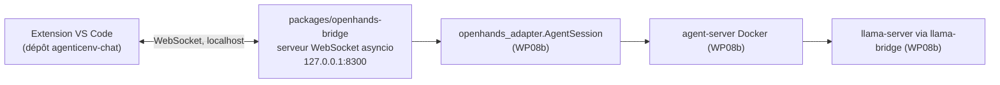

# WP08c — Client de chat interactif pour OpenHands (bridge + extension VS Code)

> **Contexte** : suite de WP08 (CLI headless) et WP08b (sandbox Docker via le SDK).
> L'utilisateur veut une expérience proche de Claude Code / Copilot Chat — un
> panneau de chat **dans VS Code**, à côté de l'arborescence du projet — plutôt que
> le CLI `openhands` en terminal ou l'app web autonome Agent Canvas. L'extension
> VS Code communautaire pour ACP (`formulahendry.acp-client`) existe mais a des
> retours mitigés, et le protocole ACP est plus pauvre que l'API native du
> `agent-server` (pas de diff de fichiers structuré ni d'usage tokens côté ACP).
>
> **Décision** : construire un client sur mesure au-dessus de `openhands_adapter`
> (WP08b), pas au-dessus d'ACP. Trois briques SDK réutilisées telles quelles :
> `RemoteWorkspace.git_changes()`/`.git_diff()` (fichiers modifiés),
> `conversation.conversation_stats.get_combined_metrics()` (contexte/coût),
> `Conversation(callbacks=[...])` (streaming des événements).

**Fichiers à lire** : ce fichier · [WP08b-openhands-sandbox.md](WP08b-openhands-sandbox.md)
(dépendance directe) · [WP08-openhands-integration.md](WP08-openhands-integration.md) §9 (politique de confirmation)

**Dépend de** : WP08b. **Bloque** : rien.

> **État (2026-09-05) — Phase 1 : backend vérifié e2e, extension scaffoldée.**
> `packages/openhands-bridge` (serveur WebSocket) : lint/mypy/import-linter verts,
> tests unitaires verts, `test_bridge_e2e.py` (`@pytest.mark.e2e`) **passe** —
> conteneur `agent-server` démarré via `AgentSession`, réponse streamée événement
> par événement, 12 fichiers modifiés + usage poussés après le tour, conteneur
> arrêté proprement (2 min 19 s, GPU entièrement disponible).
> Extension `agenticenv-chat` (dépôt séparé, public) : **squelette complet** —
> `tsc --noEmit`, `eslint` et `esbuild` passent dans un conteneur `node:20` ;
> panneau webview React, client WS avec reconnexion, sélecteur MCP, bulles de
> chat / lignes d'outils / carte de confirmation / liste de fichiers / jauge de
> contexte. **Non encore exécuté dans un vrai VS Code** (F5) — c'est l'étape de
> validation manuelle restante.

---

## 1. Deux dépôts

| Brique | Dépôt | Techno | Raison |
|---|---|---|---|
| `openhands-bridge` (serveur WebSocket) | **`AgenticEnv`** (ce repo), `packages/openhands-bridge` | Python, même conventions que `-mcp` | infra d'atelier, au-dessus d'`openhands_adapter` |
| Extension de chat | **`agenticenv-chat`** (nouveau, public) | TypeScript + webview | packaging `.vsix` et outillage npm distincts — comme `quant-modeling` est séparé d'`AgenticEnv` |

## 2. Phasage

| Phase | Contenu | État |
|---|---|---|
| **1 — backend** | `openhands-bridge` : chat streamé, fichiers modifiés, contexte/coût, sélection MCP en pré-session (UI seulement), pauses via `ConfirmRisky()` (accept/reject) | **fait, vérifié e2e** |
| **1 — client** | Extension VS Code : panneau webview, connexion WS au bridge, rendu chat/diffs/jauge de contexte/carte de confirmation/cases MCP | à faire |
| **2** | MCP réellement utilisable *depuis le sandbox* (bridge `streamable-http`, cf. WP08b §7) | différé |
| **3** | Vraie question structurée type `AskUserQuestion` (outil custom + image `agent-server` personnalisée) | différé |

## 3. Architecture (Phase 1)

Le bridge est lancé à la main (`just run-bridge` / `uv run openhands-bridge`,
`127.0.0.1:8300` par défaut, `AGX_OPENHANDS_BRIDGE_PORT` pour changer). Les
**connexions ne sont pas verrouillées** — un client peut se connecter, lister
les MCP et lire la santé à tout moment, et se reconnecter librement (l'hôte
d'extension VS Code coupe/rouvre le socket à chaque reload). Seul un **2ᵉ
`start_session` concurrent** (2ᵉ sandbox Docker) est refusé (`SESSION_BUSY`,
connexion maintenue). Un keepalive WS court (`ping_interval=10`) libère vite la
propriété de la session si un socket d'extension meurt.

> Piège corrigé le 2026-09-05 : la première version tenait un verrou pendant
> toute la durée d'une connexion → après un reload VS Code, l'ancienne connexion
> morte bloquait la nouvelle (`SESSION_BUSY` + fermeture immédiate) → bannière qui
> clignote, liste MCP perdue (envoyée une seule fois au chargement),
> `start_session` sans effet (socket pas ouvert). Côté extension : re-demande de
> la liste MCP à chaque (re)connexion, bannière « disconnected » temporisée,
> bandeau d'erreur si un envoi tombe faute de socket ouvert.

### Ce qui a été ajouté à `openhands_adapter` (WP08b) pour le bridge

- `AgentSession(callbacks=[...])` — transmis à `Conversation(callbacks=...)`.
- `AgentSession(project_path=...)` — répertoire hôte bind-monté à
  `/workspace/project` (un **sous-dossier** de `/workspace` : la persistance
  interne de l'agent-server reste à `/workspace/conversations`, hors du montage,
  donc jamais listée comme « fichier modifié » du projet). L'agent-server tourne
  en `uid 10001` : `__enter__` teste `test -w /workspace/project` et expose
  `AgentSession.project_writable` (`False` → le bridge envoie `PROJECT_READONLY`
  avec la commande `setfacl` qui donne l'accès sans changer le propriétaire).
- `AgentSession.conversation` / `.workspace` / `.llm_source` — propriétés publiques
  (le bridge lit `workspace.git_changes(".")` et
  `conversation.conversation_stats` directement).
- `AgentSession.send(message, blocking=...)` — `blocking=False` déclenche le run
  et rend la main (le bridge suit la suite via les callbacks). `run_task` reste
  `blocking=True`.
- `openhands_adapter/__init__.py` ré-exporte `Event`,
  `ConversationStateUpdateEvent`, `ConfirmRisky`/`NeverConfirm`/… pour que
  `openhands_bridge` n'importe **jamais** `openhands.*` directement (contrat D15).

### Fichiers modifiés (`files_changed`)

Le bridge appelle `workspace.git_changes(".")` (résolu dans le `working_dir` du
sandbox) après chaque tour, puis **filtre** : rien qui commence par
`conversations/`, `.git/`, `.openhands/`, ni `owner_lease.json`/`meta.json` ; et
si la liste dépasse 200 entrées (répertoire non-git ⇒ l'agent-server liste tout)
elle est vidée. Sans `project_path`, `/workspace` est vide → liste vide (correct).

## 4. Protocole WebSocket

JSON, un seul canal. `client → bridge` : `start_session {mcp_servers}`,
`user_message {text}`, `confirm_action {accept}`, `list_mcp_servers {}` (catalogue
pour le sélecteur pré-session, sans effet de bord, valide avec ou sans session).
`bridge → client` : `session_started {conversation_id, llm_source}`, `event {…}`
(un `Event.model_dump(mode="json")` du SDK), `files_changed {changes: [{status, path}]}`,
`usage {accumulated_cost, prompt_tokens, completion_tokens, context_window}`,
`awaiting_confirmation {conversation_id}`, `mcp_servers {servers: [{name, transport, tools_allowlist}]}`,
`error {code, message, details}`.

Modèles pydantic dans `packages/openhands-bridge/src/openhands_bridge/protocol.py`
— délibérément **découplés** des types SDK (le fil est un contrat stable à nous,
traduit dans `server.py`).

## 5. Pauses de confirmation (substitut Phase 1)

Le bridge utilise `ConfirmRisky()` (au lieu du `NeverConfirm()` de WP08b) : quand
`execution_status` passe à `waiting_for_confirmation`, il pousse
`awaiting_confirmation` ; le client affiche une carte accept/reject ; la réponse
va à `POST /api/conversations/{id}/events/respond_to_confirmation` (`accept:true`,
appel direct via `workspace.client` — pas de méthode SDK pour le « accept », cf.
WP08b) ou à `conversation.reject_pending_actions()`. Ce n'est pas encore une
question à choix multiples libre (Phase 3).

## 6. Tests

| Test | Attendu |
|---|---|
| `test_protocol.py` | (dé)sérialisation des messages, rejet des `type` inconnus et des champs en trop |
| `test_mcp_catalog.py` | lecture de `configs/mcp/*.yaml` → liste pour l'UI ; répertoire manquant ⇒ `ConfigError` |
| `test_bridge_e2e.py` (`@pytest.mark.e2e`) | round-trip WebSocket complet contre une vraie sandbox : `session_started` d'abord, réponse streamée contenant `TEST_FINAL`, `files_changed` + `usage` après le tour, réponse auto aux `awaiting_confirmation`. **Vert.** |

`just lint` (dont `mypy -p openhands_bridge`, contrat D15) et `just test` verts.
`just test-e2e` ne couvre que `openhands_adapter` ; lancer le e2e du bridge par
`uv run pytest packages/openhands-bridge -m e2e`.

## 7. Pièges

| Piège | Conduite à tenir |
|---|---|
| Ordre des messages | `AgentSession.__enter__` fait émettre des événements par le thread WS du SDK **avant** `session_started` — `server.py:_EventRelay` les tamponne jusqu'à l'envoi de `session_started`, ordre garanti pour le client. |
| `ConfirmRisky()` = plus lent | ajoute une analyse de risque (potentiellement 1 appel LLM par action) ; sur ce 30B local un tour trivial peut dépasser 600 s. Marge client ≥ 1200 s ; ne jamais supposer qu'un tour de chat reste de l'ordre de la seconde ici. |
| GPU partagé | si un autre job GPU tourne (ingestion MinerU, cf. `.mineru-venv`), `llama-server` peut ne pas rentrer en VRAM (`cudaMalloc failed: out of memory`, boucle de crash `llama-server`). Vérifier `nvidia-smi` avant ; un seul gros consommateur GPU à la fois. |
| Streaming vs blocage | le bridge appelle `session.send(text, blocking=True)` dans un `asyncio.to_thread` — le run bloque le thread worker, pas la boucle asyncio, qui reste dispo pour recevoir `confirm_action` en parallèle. |

## 8. Extension VS Code — dépôt `agenticenv-chat` (public, séparé)

TypeScript, webview React + esbuild. `tsc --noEmit`/`eslint`/`esbuild` validés
(conteneur `node:20`, Node absent de la machine hôte).

| Fichier | Rôle |
|---|---|
| `src/extension.ts` | hôte d'extension : `WebviewViewProvider` (panneau sidebar), relie `BridgeClient` ↔ webview par `postMessage`, commandes « new session » / « reconnect », `openDiff` via `git.openChange`, sondage santé toutes les 8 s + actions dans un terminal |
| `src/bridgeClient.ts` | client WebSocket vers `openhands-bridge`, reconnexion à backoff plafonné |
| `src/health.ts` | checks côté hôte (`systemctl is-active`, `curl /v1/models`, `docker version`/`image inspect`, `nvidia-smi`, sonde TCP du bridge) — fonctionne même bridge éteint ; `actionCommand()` mappe (composant, action) → commande shell |
| `src/protocol.ts` | miroir TypeScript du protocole (`openhands_bridge/protocol.py`), **à garder en phase à la main** |
| `src/webview/{App,components}.tsx` | UI React : bannière de connexion, `HealthPanel` (état bridge / `llama-server` / `llama-bridge` / Docker / image `agent-server` / GPU + boutons start/stop/restart/pull), `McpPicker` (pré-session), bulles chat, `ToolRow` (thought + args/result dépliables), `ConfirmCard` (Allow/Reject), `FileChanges`, `ContextGauge` (`prompt_tokens / context_window`) |

Les boutons du `HealthPanel` lancent la commande dans un terminal VS Code
« AgenticEnv » (les `sudo systemctl …` demandent le mot de passe) — le bridge
lui-même **ne fait jamais de `sudo`**, ce qui évite d'en faire une surface
d'escalade de privilèges alors qu'il écoute sur le réseau.

- Un panneau, une session à la fois, bouton « new session ».
- Réglage `agenticenvChat.bridgeUrl` (défaut `ws://127.0.0.1:8300`).
- Les 4 features de base demandées sont couvertes ; la sélection MCP montre la
  liste mais n'a pas encore d'effet dans le sandbox (Phase 2).
- **Reste à faire** : lancer dans un vrai VS Code (F5), itérer sur le rendu.
