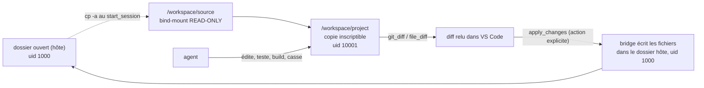

# WP08d — L'agent développe sur une copie sandbox ; application au repo à la demande

> **Contexte** : suite de WP08b (sandbox Docker via le SDK) et WP08c
> (`openhands-bridge` + extension `agenticenv-chat`). Jusqu'ici, `AgentSession`
> **bind-monte le dossier ouvert** de l'utilisateur dans le sandbox
> (`/workspace/project`) : l'agent édite directement les vrais fichiers, et
> l'annulation passe par des checkpoints git côté hôte (modèle « a fait, je peux
> annuler » — cf. `agenticenv-chat` blueprint P4 / C06).
>
> **Ce WP change ce modèle**, sur décision de l'opérateur : l'agent doit pouvoir
> **expérimenter librement dans une copie isolée** (lancer les tests, casser le
> build, essayer des choses, faire `rm -rf`) sans jamais toucher le repo réel, et
> les modifications ne rejoignent le dossier de l'utilisateur que **sur action
> explicite** (« Apply »). C'est un modèle « développe dans le bac à sable, puis
> j'applique », proche du review-diff-then-apply.
>
> Bénéfice secondaire : ça **supprime le problème d'uid**. Aujourd'hui le
> conteneur (`uid 10001`) ne peut pas écrire un bind-mount possédé par
> l'utilisateur (`PROJECT_READONLY` + `setfacl`). Avec ce modèle, c'est le
> **bridge** — qui tourne avec l'utilisateur (`uid 1000`) — qui réécrit les
> fichiers dans le repo réel. Plus aucune manipulation de permissions.

**Fichiers à lire** : ce fichier · [WP08b-openhands-sandbox.md](WP08b-openhands-sandbox.md) ·
[WP08c-chat-client.md](WP08c-chat-client.md) · côté client :
`agenticenv-chat/docs/bridge-v2-spec.md` §4.6/§4.9, `agenticenv-chat/blueprint/wp/C06-edits-and-diffs.md`,
`agenticenv-chat/blueprint/00-PRIMER.md` P4

**Dépend de** : WP08c. **Bloque** : rien.

> **État (2026-09-06) : planifié, non implémenté.**

---

## 1. Le modèle

| Invariant |
|---|
| Le repo réel de l'utilisateur n'est **jamais** monté en écriture dans le conteneur. |
| Le conteneur ne peut donc **jamais** corrompre le repo réel, quoi que fasse l'agent. |
| Seul le **bridge** écrit dans le repo réel, et **uniquement** sur `apply_changes`. |
| La copie sandbox est **jetable** : détruite avec le conteneur (`--rm`) en fin de session. Ce qui n'a pas été appliqué est perdu — c'est voulu. |

---

## 2. Constitution de la copie (`openhands_adapter`)

`AgentSession(project_path=...)` change de comportement :

1. bind-mount `project_path` en **lecture seule** à `/workspace/source`
   (`volumes=[f"{project_path}:/workspace/source:ro"]`) ;
2. après démarrage du conteneur, `execute_command` dans le conteneur :
   `cp -a /workspace/source/. /workspace/project/` (copie fidèle : arbre de
   travail + `.git` + fichiers non suivis + modifications non commitées) ;
3. si `/workspace/project/.git` existe : `git -C /workspace/project add -A &&
   git -C /workspace/project commit -q -m "agenticenv: session baseline"
   --allow-empty` sur un **ref technique** (`refs/agenticenv/baseline`) — c'est la
   base de diff de la session ; sinon, snapshot des hash de fichiers en mémoire ;
4. `working_dir` de l'agent = `/workspace/project`.

| Décision | Justification |
|---|---|
| `cp -a` (pas `git clone`) | fidèle : porte l'arbre de travail non commité et les non-suivis, et marche hors dépôt git. Un `git clone --local --shared` + patch est une optimisation ultérieure pour les gros `.git`. |
| montage `source` en lecture seule | l'agent peut **lire** l'état réel (utile s'il veut comparer), sans aucun risque d'écriture. |
| baseline sur un ref hors `refs/heads` | ne pollue ni `git log` ni `git branch` de la copie ; jamais poussé nulle part. |

`AgentSession` expose :
- `working_copy_root` → `/workspace/project` (== `workspace.working_dir`) ;
- `baseline_ref` / `baseline_hashes` pour le calcul de diff ;
- `run_task` sans `project_path` : `/workspace` vide, aucune copie (inchangé).

Le check `project_writable` / le message `PROJECT_READONLY` de WP08c **disparaissent**
(plus de bind-mount inscriptible).

---

## 3. Nouveau protocole (`openhands-bridge`)

S'appuie sur la négociation `hello`/`welcome` + `seq` de la v2
(`agenticenv-chat/docs/bridge-v2-spec.md` §1-3) — WP08d apporte **la moitié
bridge** des capabilities `diffs` et `checkpoints`, **plus** une nouvelle
capability `apply`.

### 3.1 capability `diffs` (déjà spec côté client, §4.6) — passe de « priorité basse » à **cœur**

Dans le modèle bind-mont, l'hôte avait les fichiers → `file_diff` était optionnel.
Ici l'hôte **n'a plus** les fichiers de l'agent → `file_diff` et l'équivalent
« tous les fichiers » deviennent le seul moyen de relire.

| Sens | Message | Charge |
|---|---|---|
| bridge → client | `files_changed` | `{changes: [{status, path}], seq}` — inchangé, déjà émis après chaque tour, déjà filtré (`conversations/`, `.git/`, …) |
| client → bridge | `request_diff` | `{path}` |
| bridge → client | `file_diff` | `{path, unified, truncated, seq}` — `git -C /workspace/project diff refs/agenticenv/baseline -- <path>` ; `truncated` si > 256 Kio |
| client → bridge | `request_bundle_diff` *(nouveau)* | `{}` — diff unifié de **tous** les fichiers changés |
| bridge → client | `bundle_diff` *(nouveau)* | `{unified, truncated, seq}` |

### 3.2 capability `checkpoints` (déjà spec, §4.9) — devient **cœur**

Le client faisait ses checkpoints côté hôte (host == agent). Ici host != agent →
les checkpoints vivent **dans la copie sandbox**, pilotés par le bridge.

| Sens | Message | Charge / effet |
|---|---|---|
| bridge → client | `checkpoint` | `{checkpoint_id, turn_id, created_at, files, seq}` — émis **avant** chaque tour susceptible d'écrire : `git -C /workspace/project stash create` (ou commit dangling) → `checkpoint_id` = son sha |
| client → bridge | `restore_checkpoint` | `{checkpoint_id}` → `git -C /workspace/project restore --source <sha> -- .` + `git clean` des créations ; ré-émet `files_changed` |
| bridge → client | `checkpoint_restored` *(nouveau)* | `{checkpoint_id, seq}` |

### 3.3 capability `apply` *(entièrement nouvelle — le cœur de WP08d)*

| Sens | Message | Charge |
|---|---|---|
| client → bridge | `apply_changes` | `{paths?: string[], force?: bool}` — `paths` absent = tous les fichiers changés |
| bridge → client | `changes_applied` | `{applied: [{path, status}], skipped: [{path, reason}], seq}` |
| client → bridge | `discard_changes` | `{paths?: string[]}` — remet ces fichiers à la baseline dans la copie (l'agent repart propre) |

**Mécanique de `apply_changes`**, exécutée par le bridge (`uid 1000`) :

1. pour chaque fichier changé (via `git_changes` filtré) :
   - récupérer son contenu de la copie : `workspace.file_download(f"/workspace/project/{rel}", tmp)` (API SDK, WP08c la cite) ;
   - **détection de conflit** : comparer le hash du fichier **hôte actuel** à celui
     enregistré (au `start_session` ou au dernier `apply` réussi). S'il a changé et
     `force` est faux → `skipped {reason: "host file changed since session start"}` ;
   - sinon écrire `project_path/<rel>` (créer les dossiers), en préservant fin de
     ligne / encodage ; pour `status == DELETED` → supprimer côté hôte ;
2. mettre à jour la table des hash hôte pour les fichiers appliqués ;
3. répondre `changes_applied`.

Le client (C06) affiche ensuite le résultat, propose « open the applied files »,
et c'est le **git de l'utilisateur** qui devient le filet (il relit `git diff`
dans son repo, commit ou `git checkout` comme d'habitude).

### 3.4 Mode lecture seule (Ask / Plan — dépendance client déjà listée)

`start_session` gagne `mode?: "agent" | "read_only"`. En `read_only` : la copie
est faite (l'agent peut lire/expérimenter en RAM/`/tmp`) mais `apply_changes` est
**refusé** (`error {code: "READ_ONLY_SESSION"}`), et le bridge annonce la
capability `apply` sans la permettre — le client grise le bouton.

---

## 4. Fichiers touchés

| Fichier | Changement |
|---|---|
| `packages/openhands_adapter/src/openhands_adapter/session.py` | montage `:ro` de `source`, `cp -a` vers `project`, ref baseline, propriétés `working_copy_root`/`baseline_ref`, suppression du check `project_writable` |
| `packages/openhands_adapter/src/openhands_adapter/docker_workspace.py` | accepter un volume `:ro` (déjà supporté par `-v` ; vérifier) |
| `packages/openhands-bridge/src/openhands_bridge/protocol.py` | `Hello`/`Welcome`/`seq` (base v2), `request_diff`/`file_diff`, `request_bundle_diff`/`bundle_diff`, `checkpoint`/`restore_checkpoint`/`checkpoint_restored`, `apply_changes`/`changes_applied`/`discard_changes`, `start_session.mode` |
| `packages/openhands-bridge/src/openhands_bridge/server.py` | négociation `hello`, checkpoint avant chaque tour, gestion `apply_changes` (download + conflit + write host-side), table de hash hôte, `discard_changes` |
| `packages/openhands-bridge/src/openhands_bridge/apply.py` *(nouveau)* | logique d'application (download, conflit, écriture, suppression, préservation EOL) — testable sans Docker avec un faux workspace |
| `blueprint/wp/WP08c-chat-client.md` | note : le modèle bind-mount est remplacé par WP08d ; `PROJECT_READONLY` retiré |
| `blueprint/README.md` | ligne + mermaid WP08d |

**Coordination inter-dépôts** (à faire dans `agenticenv-chat`, hors de ce WP mais
à signaler) :
- `blueprint/00-PRIMER.md` **P4** est à réécrire : ce n'est plus « a fait, je peux
  annuler » mais « a fait dans le bac à sable, j'applique quand je veux ». Le
  modèle mental redevient proche d'un review-then-apply, mais **par tour**, pas
  par édition.
- `C06` : les checkpoints passent côté bridge (le client les consommait déjà en
  capability `checkpoints`, jusqu'ici « priorité basse ») ; ajouter le panneau
  « unapplied changes » + le bouton **Apply** / **Apply all** / **Discard**.
- `docs/bridge-v2-spec.md` : ajouter la capability `apply` ; requalifier `diffs`
  et `checkpoints` de « priorité basse » à « requis ».

---

## 5. Vérification

**Unitaire** (`packages/openhands-bridge`, sans Docker) :
- `apply.py` : conflit détecté quand le hash hôte a bougé ; `force` outrepasse ;
  `DELETED` supprime ; création de sous-dossiers ; CRLF préservé ; chemin hors
  `working_copy` refusé.
- `protocol.py` : (dé)sérialisation des nouveaux messages, `seq` monotone.

**e2e** (`@pytest.mark.e2e`, manuel — garder **court**, cf. les timeouts observés
en WP08c) :
- `start_session` avec un repo git temporaire → la copie existe, `git log` de la
  copie montre `refs/agenticenv/baseline`, le repo hôte est **intact** ;
- un tour trivial (« réponds TEST_FINAL ») → `files_changed == []`, repo hôte intact ;
- `apply_changes` sur un fichier créé à la main dans la copie (via `execute_command`,
  pas via l'agent — plus rapide/fiable) → le fichier apparaît dans le repo hôte
  avec le bon **propriétaire** (`uid 1000`) ;
- conflit : modifier le fichier hôte entre-temps → `apply_changes` sans `force`
  répond `skipped`, avec `force` écrase.

**F5** (dans un vrai VS Code, une fois le client rattrapé) : chatter, voir le
panneau « unapplied changes », relire un diff, cliquer Apply, voir le fichier
changer dans l'explorateur et `git status` du repo réel.

---

## 6. Pièges

| Piège | Conduite à tenir |
|---|---|
| `cp -a` d'un gros repo (`.git` volumineux) | mesurer ; si trop lent, `git clone --local --shared /workspace/source /workspace/project` + `git checkout` + copie des non-suivis. Ne pas optimiser avant d'avoir mesuré. |
| L'agent lit `/workspace/source` et s'y attache | le prompt système / `AGENTS.md` doit dire que le travail se fait dans `/workspace/project` ; `source` est une référence en lecture seule. |
| Conflit d'application silencieux | **jamais** d'écriture aveugle : hash hôte comparé à chaque `apply`, `skipped` explicite, `force` réservé à une action utilisateur consciente. |
| Fin de ligne / encodage à l'écriture | lire le fichier hôte existant pour détecter EOL/BOM et les reproduire ; test dédié. Un apply ne doit pas convertir CRLF↔LF. |
| Session fermée avec des changements non appliqués | c'est le comportement voulu (bac à sable jetable), mais le **client** doit prévenir (« N unapplied changes, end anyway? »). |
| Checkpoints qui polluent la copie | ref technique hors `refs/heads`, jamais de commit sur une branche ; la copie est jetable de toute façon. |
| Build/test dans le sandbox | l'agent-server image n'a pas forcément le toolchain du projet (C++/`cppdev`). Hors périmètre WP08d ; à traiter par une image sandbox dédiée si besoin (cf. `infra/docker/sandbox/Dockerfile`, jamais câblé). |

---

## 7. Critères d'acceptation

- [ ] `AgentSession(project_path=...)` monte `source` en `:ro`, constitue
  `/workspace/project` par copie, pose une baseline ; le repo hôte est prouvé
  intact après une session.
- [ ] `git_changes`/`file_diff`/`bundle_diff` calculés sur la copie contre la baseline.
- [ ] `checkpoint` émis avant chaque tour ; `restore_checkpoint` restaure la copie.
- [ ] `apply_changes` écrit dans le repo hôte avec `uid 1000`, détecte les conflits,
  supprime les fichiers supprimés, préserve l'EOL.
- [ ] `mode: "read_only"` refuse `apply_changes`.
- [ ] `PROJECT_READONLY` / `project_writable` retirés (plus de bind-mount inscriptible).
- [ ] `apply.py` couvert sans Docker ; `mypy --strict` + `import-linter` (contrat
  D15 étendu) + `just lint`/`just test` verts.
- [ ] `blueprint/README.md` et `WP08c` référencent WP08d ; les 3 items de
  coordination `agenticenv-chat` (§4) sont ouverts en issues/notes.
