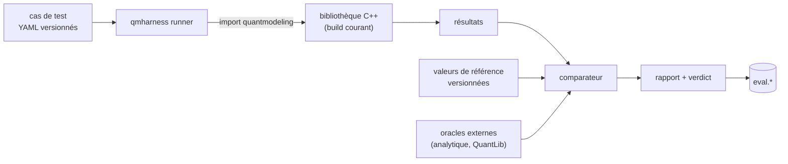

# WP09 — `qmharness` : harnais de non-régression numérique

> **Contexte** : `AgenticEnv` est un atelier agentique dont le produit cible est le
> repo C++ `quant-modeling` (pricing de dérivés : ~26 instruments, 8 modèles, moteurs
> Analytic/MC/PDE/Tree, Monte Carlo avancé — Sobol RQMC, pont brownien, variables de
> contrôle, Monte Carlo conditionnel). Le repo expose déjà un module Python via
> **pybind11** (`quantmodeling`).
>
> **Aucun moteur de pricing n'est réimplémenté ici.** L'oracle numérique, c'est la
> bibliothèque C++ elle-même, plus des références externes indépendantes.

**Fichiers à lire** : ce fichier · [10-TARGET-REPO.md](../10-TARGET-REPO.md) §2 et §3 ·
[08-TESTING.md](../08-TESTING.md) §3 · [03-INTERFACES.md](../03-INTERFACES.md) §6

**Dépend de** : WP02 (build), WP01. **Bloque** : rien.

---

## 1. Problème à résoudre

> Le mode d'échec le plus grave d'un agent autonome sur une bibliothèque de pricing
> n'est pas de casser le build. C'est de **déplacer un prix sans que personne ne le
> remarque**.

Un refactor de conventions de temps, une templatisation pour l'AAD, une optimisation
de noyau : chacun peut modifier un résultat de quatrième décimale sans casser un seul
test de compilation. Ce package rend ce déplacement **visible et bloquant**.

---

## 2. Approche

Piloter la bibliothèque C++ **par ses bindings pybind11 existants**, depuis Python.
Aucune duplication de logique financière.



---

## 3. Les cinq familles de vérification

### 3.1 Valeurs de référence (golden values)

Cas figés dans `benchmarks/golden/*.yaml` : entrées complètes, prix attendu,
tolérance, **source de la référence**.

| Règle |
|---|
| Une valeur de référence est vérifiée contre une source **externe indépendante** avant d'être figée. Ne jamais figer une valeur produite par le code qu'on teste. |
| Toute modification d'une valeur de référence exige une justification écrite et une validation humaine (règle R1 de [10-TARGET-REPO.md](../10-TARGET-REPO.md)). |
| Le fichier de références est versionné dans Git : le diff est la trace de l'impact. |

### 3.2 Cohérence inter-moteurs

Le repo possède déjà ces contrôles — mais dans `main.cpp`, en `std::cout`, sans
assertion. Ce package les transforme en verdicts.

| Comparaison | Tolérance |
|---|---|
| Analytic vs Monte Carlo | dans 3 erreurs-types MC |
| Analytic vs PDE vs Binomial vs Trinomial | tolérance relative par produit |
| MC pseudo-aléatoire vs Sobol RQMC | intervalles compatibles |
| Avec vs sans variable de contrôle | même espérance, variance réduite |
| Avec vs sans échantillonnage préférentiel | même espérance |
| CMC vs MC brut sur digitales et barrières | même espérance, variance réduite |

### 3.3 Invariants financiers

| Invariant |
|---|
| Parité call/put |
| Bornes de non-arbitrage |
| Parité barrière : in + out = vanille |
| Digitale = limite d'un call spread resserré |
| Monotonie en strike, en volatilité ; convexité en strike |
| Limites $\sigma \to 0$ et $T \to 0$ |
| Aller-retour volatilité implicite |
| Asiatique géométrique ≤ arithmétique (même paramètres) |

### 3.4 Convergence et propriétés statistiques

| Vérification |
|---|
| Erreur MC en $1/\sqrt{N}$ — **pente mesurée** sur échelle log-log |
| QMC : meilleur ordre de convergence que le pseudo-aléatoire |
| Ordre de convergence des schémas PDE et des arbres |
| Reproductibilité du flux PCG32 |
| Propriétés de Sobol : équidistribution des premières dimensions, effet du brouillage |
| Covariance du pont brownien conforme à la théorie |
| Couverture de l'intervalle de confiance : sur K répétitions, ~95 % contiennent la référence |

### 3.5 Greeks

| Vérification |
|---|
| Pathwise vs LRM vs différences finies vs analytique |
| **Futur AAD** : adjoint vs bump-and-revalue à nombres aléatoires communs vs pathwise — *le harnais de validation exigé par la Phase C* |
| Cohérence des erreurs-types rapportées |

---

## 4. Modes d'exécution

| Mode | Usage | Durée cible |
|---|---|---|
| `quick` | à chaque commit de l'agent : golden values + invariants, faible nombre de chemins | < 60 s |
| `standard` | avant fin de tâche : + cohérence inter-moteurs, + greeks | < 10 min |
| `full` | avant merge : + convergence, + statistiques, + tous les produits | illimité |

> Le mode `quick` doit être **assez rapide pour que l'agent l'exécute sans hésiter**.
> Un harnais qu'on n'exécute pas ne sert à rien.

---

## 5. Comparaison de deux builds

L'usage principal : « ce refactor a-t-il changé un prix ? »

```text
qm compare --baseline <ref git ou snapshot> --candidate HEAD
```

Sortie : pour chaque cas, prix baseline, prix candidat, écart absolu et relatif,
verdict. Les cas déplacés au-delà du bruit statistique sont listés en tête.

| Règle |
|---|
| Pour les cas déterministes (analytique, PDE, arbres), tout écart non nul est signalé. |
| Pour les cas Monte Carlo à graine fixée, tout écart non nul est signalé — le déterminisme est attendu. |
| Un écart attribué au « bruit MC » doit être justifié par un changement de graine ou de nombre de chemins, explicitement. |

---

## 6. Livrables

```text
packages/qmharness/
├── src/qmharness/
│   ├── schemas.py      # CaseSpec, CaseResult, ComparisonReport
│   ├── loader.py       # chargement des cas YAML
│   ├── driver.py       # pilotage du module pybind11 quantmodeling
│   ├── oracles/
│   │   ├── analytic.py # formules fermées indépendantes (référence croisée)
│   │   └── external.py # oracle externe optionnel, dépendance de test uniquement
│   ├── checks/
│   │   ├── golden.py
│   │   ├── cross_engine.py
│   │   ├── invariants.py
│   │   ├── convergence.py
│   │   ├── statistics.py
│   │   └── greeks.py
│   ├── compare.py      # baseline vs candidate
│   ├── report.py       # markdown + JSON
│   └── cli.py
└── tests/

packages/qmharness-mcp/
└── src/qmharness_mcp/tools/{run,compare,list_cases}.py

benchmarks/golden/*.yaml       # dans le repo cible, versionnés
```

---

## 7. Outils MCP

| Outil | Rôle | Timeout |
|---|---|---|
| `qm.run` | Exécute une famille de vérifications dans un mode donné | 1800 s |
| `qm.compare` | Compare deux builds sur l'ensemble des cas | 1800 s |
| `qm.list_cases` | Liste les cas disponibles, par produit et famille | 15 s |
| `qm.explain_failure` | Détail d'un cas échoué : entrées, attendu, obtenu, écart, diagnostic | 30 s |

`qm.explain_failure` est important : il évite que l'agent relance tout le harnais pour
comprendre un seul échec.

---

## 8. Contrainte d'environnement

| Règle |
|---|
| Le module `quantmodeling` importé est celui du **build courant de la sandbox**, jamais une version installée ailleurs. Le harnais vérifie et journalise le chemin et le hash du `.so`. |
| Le mode `full` et les mesures de temps ne sont fiables que si `llama-server` est au repos. L'outil vérifie et avertit. |
| Toute exécution enregistre : commit Git, preset de build, compilateur et version, options d'optimisation. Deux résultats ne sont comparables que si ces éléments concordent — `qm.compare` refuse sinon. |

---

## 9. Évaluation du RAG et de l'agent (secondaire)

Conservé de la spécification initiale, mais **de priorité inférieure** au harnais
numérique. À traiter après que WP02, WP03 et §3 ci-dessus soient opérationnels.

| Axe | Mesure |
|---|---|
| Retrieval | recall@k, precision, MRR, NDCG, exactitude des citations |
| Gain du RAG | même suite avec `retrieval_enabled` à `false` puis `true` |
| Agent | sélection d'outil, auto-correction, gestion d'erreur, exactitude de la contribution produite |

Les jeux de questions portent sur **ce projet** : conventions de décompte des jours,
génération d'échéanciers, AAD sur Monte Carlo, lissage des payoffs discontinus,
propriétés de Sobol — pas sur la finance quantitative en général.

Migration `migrations/0004_schema_eval.sql` conservée pour la persistance des runs.

---

## 10. Tests du package

| Test | Attendu |
|---|---|
| Chargement de cas | cas malformé ⇒ `ValidationError` explicite, jamais ignoré |
| Comparaison | écart correctement calculé, absolu et relatif |
| Détection de régression | une valeur volontairement déplacée est détectée |
| Refus de comparaison | builds de compilateurs ou presets différents ⇒ refus explicite |
| Détermination du `.so` | le module chargé est bien celui du build courant |
| Déterminisme | deux exécutions identiques ⇒ mêmes résultats |
| Aucun effet de bord | le harnais ne modifie jamais le repo cible |

---

## 11. Critères d'acceptation

- [ ] Le harnais pilote la bibliothèque C++ réelle via les bindings existants.
- [ ] Les cinq familles de vérification (§3) sont implémentées.
- [ ] Mode `quick` sous 60 s.
- [ ] `qm.compare` détecte un déplacement de prix volontairement introduit.
- [ ] Refus de comparer deux builds non comparables.
- [ ] Rapport markdown + JSON, résultats persistés.
- [ ] Aucune formule de pricing réimplémentée hors `oracles/analytic.py`, dont chaque formule cite sa source.
- [ ] `mypy --strict` passe.

---

## 12. Piège principal

> **Le harnais ne doit jamais devenir une seconde implémentation du pricing.**

`oracles/analytic.py` se limite à des formules fermées élémentaires servant de
référence croisée indépendante. Dès qu'on est tenté d'y implémenter un modèle, c'est
que le test appartient au repo C++, pas ici.
