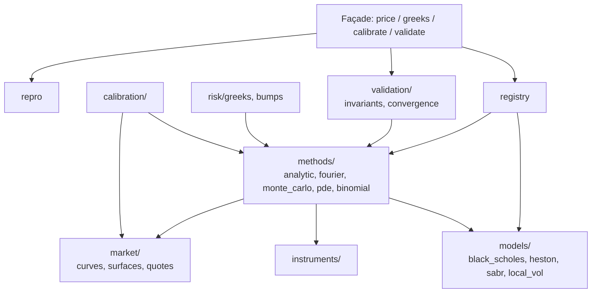

# WP02 — `quantlab` (moteur quantitatif)

> **Contexte** : plateforme locale d'agents IA dont le but est le pricing et le risk
> management de produits dérivés. Un LLM local (servi par llama.cpp) orchestre des
> outils. **Principe fondateur : le LLM ne calcule jamais.** Tout chiffre financier
> vient de ce package.
>
> `quantlab` est une **bibliothèque Python pure** : pas de base de données, pas de
> réseau, pas de LLM, pas d'écriture de fichier. Elle est appelée soit par un serveur
> MCP (WP03), soit directement dans la sandbox de l'agent.

**Fichiers à lire** : ce fichier · [03-INTERFACES.md](../03-INTERFACES.md) §2 ·
[08-TESTING.md](../08-TESTING.md) §3 · [09-CONVENTIONS.md](../09-CONVENTIONS.md) §3 (unités) ·
[06-CONFIG.md](../06-CONFIG.md) §4 (`configs/quantlab.yaml`)

**Dépend de** : WP01. **Bloque** : WP03, WP09.

---

## 1. Objectif

Un moteur de pricing déterministe, reproductible, testé par invariants, avec une
**façade unique** : `price`, `greeks`, `calibrate`, `validate`.

---

## 2. Périmètre par phase

| Phase | Contenu |
|---|---|
| **2a — MVP** | Black-Scholes analytique, Monte Carlo générique, volatilité implicite, Greeks (analytiques + bump), invariants, reproductibilité |
| 2b | Heston (Fourier + Monte Carlo), calibration, courbes d'actualisation |
| 2c | SABR, local vol, PDE, binomial, multi-courbes |

**Ne pas commencer par 2c.** La matrice de capacités doit refléter exactement ce qui
est implémenté et testé.

---

## 3. Architecture interne



**Séparation cardinale : `models` ≠ `methods`.**
Un modèle décrit une dynamique (paramètres, fonction caractéristique, schéma de
simulation). Une méthode décrit une technique numérique (analytique, Fourier, Monte
Carlo, PDE, arbre). Le couplage est déclaré dans `registry.capability_matrix()`.

---

## 4. Flux d'un appel `price()`

```text
price(PricingRequest)
 ├─ 1. parse & valider les unités          (corelib.units + sanity de configs)
 ├─ 2. registry.supports(model, method, instrument_kind)
 │      └─ non supporté -> ValidationError  [PAS de fallback]
 ├─ 3. construire ModelParams -> params.validate_domain()
 │      └─ ex. Heston : Feller ; violation -> avertissement dans diagnostics
 ├─ 4. construire MarketState (courbes, spot, date)
 ├─ 5. method.price(model, params, instrument, market, settings)
 ├─ 6. si Monte Carlo -> std_error ; si itératif -> ConvergenceReport
 │      └─ non convergé -> NumericalError   [JAMAIS de prix renvoyé]
 ├─ 7. repro.build_run(...)
 └─ 8. PricingResult(price, std_error, convergence, diagnostics, run)
```

---

## 5. Règles non négociables

| # | Règle |
|---|---|
| Q1 | **Aucun fallback silencieux.** Couple non supporté ⇒ erreur, jamais substitution de méthode. |
| Q2 | **Aucun prix non convergé.** Non-convergence ⇒ `NumericalError` avec diagnostics. |
| Q3 | Tout résultat embarque un `PricingRun` (modèle, version, méthode, seed, tolérance, hash des entrées). Non optionnel. |
| Q4 | Déterminisme : mêmes entrées + même seed ⇒ résultat bit-identique. |
| Q5 | Unités décimales partout (`rate=0.03`, `vol=0.20`, `maturity_years=1.0`). Bornes de sanité appliquées aux entrées externes. |
| Q6 | Vectorisation NumPy obligatoire sur les chemins Monte Carlo. Aucune boucle Python par chemin. |
| Q7 | Aucun import de `sqlalchemy`, `psycopg`, `httpx`, `requests`, client LLM. Vérifié en CI. |
| Q8 | Aucune écriture de fichier, aucun `print`. |
| Q9 | Toute formule cite sa source dans un commentaire d'une ligne. |
| Q10 | Le registre est rempli à l'import ; aucun autre état global mutable. |

---

## 6. Reproductibilité

`PricingRun` contient : `run_id`, `ts`, `model`, `model_version`, `method`,
`engine_version`, `code_commit`, `seed`, `tolerance`, `inputs_sha`, `hardware`.

`inputs_sha` = hash canonique de la requête normalisée (ordre des clés stable,
flottants sérialisés de façon déterministe). C'est la clé qui permet de dire
« ce prix est bien celui de la requête X ».

La **persistance** de ce run est faite par WP03 (`quantlab_mcp` → `quant.pricing_runs`),
pas par `quantlab` lui-même.

---

## 7. Validation — `quantlab.validate`

Checks disponibles, appelables individuellement :

| Check | Ce qu'il vérifie |
|---|---|
| `put_call_parity` | relation de parité |
| `no_arbitrage_bounds` | bornes inférieure/supérieure |
| `monotonicity` | en strike, en volatilité |
| `convexity` | en strike |
| `feller` | $2\kappa\theta \ge \sigma^2$ (Heston) |
| `surface_arbitrage_free` | absence d'arbitrage calendaire et papillon |
| `convergence` | étude de convergence sur l'axe demandé |
| `cross_method` | écart entre deux méthodes pour la même requête, sous tolérance |

Sortie : rapport par check (`passed`, `value`, `threshold`, `message`).
Un check qui échoue **n'est pas** une exception : c'est un résultat de validation.

---

## 8. Tests — voir [08-TESTING.md](../08-TESTING.md) §3

Résumé des obligations :

- invariants analytiques par `hypothesis` (parité, bornes, monotonie, convexité, limites) ;
- aller-retour volatilité implicite à `1e-8` ;
- cohérence inter-méthodes pour chaque couple de la matrice ;
- convergence Monte Carlo en $1/\sqrt{N}$ (pente vérifiée) ;
- valeurs de référence dans `benchmarks/golden/reference_prices.yaml`, **vérifiées
  contre une source externe indépendante** — ne jamais figer une valeur produite par
  le code lui-même ;
- test de déterminisme ;
- test de pureté (§5 Q7).

---

## 9. Critères d'acceptation

- [ ] `capability_matrix()` reflète exactement ce qui est implémenté **et testé**.
- [ ] Tous les invariants de la phase courante passent.
- [ ] Les valeurs de référence passent avec la tolérance déclarée.
- [ ] Un couple hors matrice lève `ValidationError`.
- [ ] Une requête non convergente lève `NumericalError` (aucun prix renvoyé).
- [ ] Deux exécutions identiques avec seed donnent un résultat bit-identique.
- [ ] Test de pureté vert.
- [ ] `mypy --strict` passe.
- [ ] Migration `0006_schema_quant.sql` livrée (table `quant.pricing_runs`), même si elle n'est écrite que par WP03.

---

## 10. Pièges du domaine

| Piège | Conduite à tenir |
|---|---|
| `rate=3` au lieu de `0.03` | bornes de sanité, message d'erreur explicite |
| `vol=20` au lieu de `0.20` | idem |
| Feller violé | avertissement + diagnostic, pas un crash — c'est un régime valide mais délicat |
| Discrétisation Heston naïve | variance négative : documenter le schéma choisi et son biais |
| Greeks par bump | taille de bump en configuration, testée contre l'analytique |
| Rendement de dividende vs dividendes discrets | expliciter l'hypothèse dans `describe()` |
| Convention de day count implicite | toujours explicite dans `MarketState` |
| Seed global NumPy | interdit — générateur local passé explicitement |
