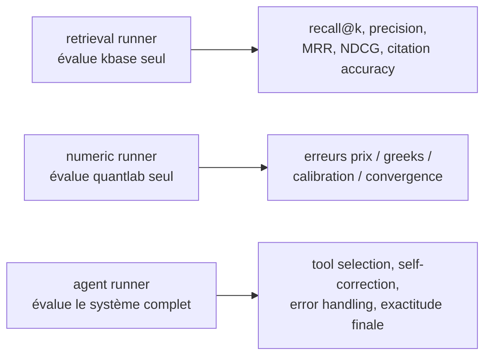

# WP09 — `evalkit` (benchmarks & métriques)

> **Contexte** : plateforme locale d'agents IA pour le pricing de dérivés. Un LLM
> local (llama.cpp, 32K de contexte) orchestre un moteur quantitatif déterministe
> (`quantlab`), un RAG financier (`kbase`, PostgreSQL + pgvector + FTS) et une
> mémoire (`agentmem`), via **OpenHands** et des serveurs MCP.
>
> Ce work package mesure si tout cela **fonctionne réellement**. Sans lui, le système
> n'est pas fiable — il est seulement plausible.

**Fichiers à lire** : ce fichier · [03-INTERFACES.md](../03-INTERFACES.md) §5 ·
[04-DATA-MODEL.md](../04-DATA-MODEL.md) §4 · [05-SEQUENCES.md](../05-SEQUENCES.md) §7 ·
[06-CONFIG.md](../06-CONFIG.md) §4

**Dépend de** : WP02, WP05 (et WP08 pour le runner agent).

---

## 1. Principe directeur

> On mesure des **différences**, pas des valeurs absolues.

La question n'est pas « le système a-t-il 72 % ? » mais « le RAG améliore-t-il le
résultat, et de combien ? ». Toute suite est exécutée avec
`retrieval_enabled=false` puis `true`.

---

## 2. Trois runners indépendants



Isoler les couches est essentiel : si l'agent échoue, il faut savoir si c'est le
retrieval, le calcul, ou l'orchestration.

---

## 3. Composition du jeu d'évaluation

Stratégie **hybride** : datasets publics de haute qualité **+** génération synthétique
vérifiée. Ni l'un ni l'autre seul.

### 3.1 Datasets externes (base non contaminée, prioritaires)

| Dataset | Apport | Usage |
|---|---|---|
| FinQA, ConvFinQA, TAT-QA | raisonnement numérique multi-hop (tables + texte) | maths / calcul |
| FinanceBench | questions sur filings réels avec evidence | RAG réaliste |
| FinDER | triplets expert-annotés, requêtes ambiguës | évaluation RAG finance |
| FAMMA | questions complexes multi-modales | connaissance + raisonnement |
| XFinBench, FinExam-10K, FinanceComplexQA, FinTextQA, OmniEval | long contexte, documents industriels | couverture large |

| Règle |
|---|
| `datasets/manifest.yaml` déclare nom, version, **licence**, checksum. |
| Vérifier la licence avant intégration. Un dataset dont la licence n'est pas compatible n'est pas ajouté. |
| Aucun dataset externe n'est commité dans Git. |
| Les adaptateurs vivent dans `evalkit/suites/external.py` : ils normalisent vers `BenchmarkItem`, sans modifier les données. |

### 3.2 Benchmark interne — 300 questions

```text
100 théorie
100 pricing / calibration
100 implémentation / méthodes numériques
```

Chaque item a une **réponse de référence**. Fichiers : `benchmarks/internal/*.yaml`.

### 3.3 Génération synthétique — pipeline obligatoire

```text
1. Seeds       = documents réels du corpus + items des datasets existants
2. Génération  = multi-pass : question -> chaîne de raisonnement -> réponse -> critique
3. Filtres     = code exécutable, cohérence numérique, déduplication sémantique,
                 score de difficulté
4. Test set    = majoritairement datasets existants + questions held-out
```

| Risque | Contre-mesure obligatoire |
|---|---|
| Hallucination sur une formule | vérification par exécution de code |
| Incohérence numérique | recalcul via `quantlab` |
| Réponse plausible mais fausse | consensus multi-génération + LLM-as-judge |
| Biais du générateur | échantillonnage humain sur un sous-ensemble |

Modèles générateurs recommandés : Claude Opus (extended thinking) en générateur
principal pour la qualité du raisonnement structuré, DeepSeek-R1 pour le volume.

> **Une question synthétique non vérifiée n'entre jamais dans le jeu de test.**

---

## 4. Métriques

### Retrieval

`recall@k`, `precision@k`, `MRR`, `NDCG@k`, **citation accuracy** (la citation
justifie-t-elle réellement l'affirmation ?).

### Numérique

| Métrique | Définition |
|---|---|
| erreur de prix | absolue et relative vs référence |
| erreur de greeks | delta, gamma, vega |
| erreur de calibration | RMSE en points de volatilité |
| erreur de convergence | écart au régime asymptotique attendu |

Exemple de forme attendue : référence `4.8271`, produit `4.8268`, erreur absolue
`0.0003` — comparée à la tolérance déclarée sur l'item.

### RAG (gain)

`Accuracy`, `Exact Match`, `Execution Accuracy` **avant vs après RAG**, `Recall@k`,
**taux d'hallucination**.

### Agent

`tool selection` (le bon outil a-t-il été choisi ?), `planning`, `code correctness`,
`test generation`, `self-correction`, `error handling`, `source selection`.

---

## 5. Juges

| Juge | Usage | Par défaut |
|---|---|---|
| `numeric` | comparaison à tolérance absolue/relative | **activé** |
| `citation` | vérifie que la source citée contient bien l'affirmation | **activé** |
| `llm` | LLM-as-judge pour les réponses ouvertes | **désactivé** (coûteux, subjectif) |

| Règle |
|---|
| Le juge est **séparé** du système sous test. |
| Un juge LLM n'est jamais le seul verdict sur une question numérique. |
| Un verdict est reproductible : même entrée ⇒ même verdict (seed fixé pour le juge LLM). |
| **Aucun retry** dans les runners : cela fausserait la mesure. |

---

## 6. Exécution & rapports

```text
evalkit run --suite internal --retrieval on|off
evalkit run --suite external:<nom>
evalkit compare --run-a <id> --run-b <id>
evalkit report --run <id> --format markdown|json
```

Chaque run enregistre `git_commit`, modèle servi, configuration système,
`retrieval_enabled`. C'est ce qui rend deux runs comparables.

Sorties : `benchmarks/results/<run_id>/report.md` et `report.json` (git-ignoré),
données dans `eval.runs` / `eval.results`.

---

## 7. Contamination — règle stricte

| Règle |
|---|
| Les documents ingérés dans `kbase` **ne doivent pas** être la source directe des réponses des items held-out. |
| Un sous-ensemble `held_out=true` n'est jamais utilisé pendant le tuning du retrieval. |
| Toute modification d'un item est tracée ; on ne « corrige » pas un item parce que le système échoue dessus. |

---

## 8. Migration livrée

`migrations/0004_schema_eval.sql` : `eval.benchmark_items`, `eval.runs`,
`eval.results` (UNIQUE `(run_id, item_id)`).

---

## 9. Seuils initiaux

Dans `configs/evalkit.yaml`. Valeurs de départ, à ajuster **une fois mesurées** :

```yaml
thresholds:
  numeric_pass_rel: 1.0e-3
  retrieval_recall_at_8_min: 0.80
```

> Ne pas ajuster un seuil pour faire passer un test. Ajuster un seuil est une
> décision documentée dans `docs/adr/`.

---

## 10. Tests du package lui-même

| Test | Attendu |
|---|---|
| Métriques de retrieval | valeurs vérifiées sur des cas construits à la main |
| Juge numérique | respecte les tolérances absolue et relative |
| Juge de citation | détecte une citation qui ne soutient pas l'affirmation |
| Déterminisme | même run ⇒ mêmes résultats |
| Isolation | un runner ne modifie jamais le système sous test |
| Chargement de suite | item malformé ⇒ `ValidationError` explicite, pas d'ignorance silencieuse |
| Comparaison de runs | refuse de comparer deux runs de configurations incompatibles |

---

## 11. Critères d'acceptation

- [ ] Les trois runners fonctionnent indépendamment.
- [ ] Benchmark interne de 300 questions constitué, chaque item avec réponse de référence.
- [ ] Au moins un dataset externe intégré, licence vérifiée.
- [ ] Comparaison avant/après RAG produite et documentée.
- [ ] Rapport markdown + JSON générés, résultats persistés en base.
- [ ] Aucun retry dans les runners.
- [ ] Seuils dans la configuration, jamais en dur.
- [ ] `mypy --strict` passe.

---

## 12. Ce que ce WP ne mesure pas

| Non mesuré | Où |
|---|---|
| Débit du modèle (tokens/s) | `infra/scripts/bench-context.sh` (WP00) |
| Latence des outils MCP | `obs.tool_invocations`, requête SQL |
| Qualité stylistique des réponses | hors périmètre |
